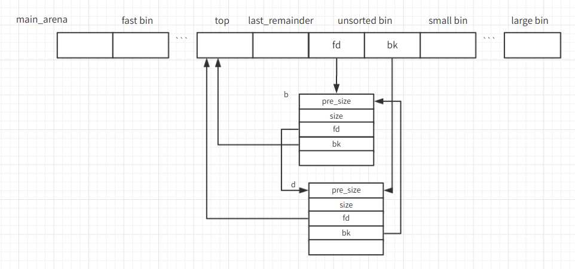

## `malloc`内存分配器

## 基本原理简述

内存配分应该是c++中绕不过的一个门槛，常见的分配函数有`malloc`,`tcmalloc`,`jemalloc`,除了`malloc`，其余的都没怎么用过。但是听说实际上的效率另外两者比`malloc`高。这里我简单的写一下`malloc`的相关内容，留给自己以后复习或者参考。最后会实现一个简单的tutorial

首先`malloc`的内存是从堆里面分配出来的，这里继续往下深究，就会设计两个`linux`的系统函数，`brk`和`sbrk`以及`mmap`

## `brk()`和`sbrk()`


```
#include <unistd.h>
int brk( const void *addr );
void* sbrk ( intptr_t incr );
```

这两个函数的作用主要是扩展heap的上界`brk`。`brk`的参数`addr`的意义就是设置新的`brk`界。成功返回0，失败返回-1；就是图中的break

第二个函数的参数为需要申请的内存的大小，然后返回heap新的上界`brk`的地址。如果参数为0，返回的为原来的`brk`地址

## `mmap`

```
#include <sys/mman.h>
void *mmap(void *addr, size_t length, int prot, int flags, int fd, off_t offset);
int munmap(void *addr, size_t length);
```

`mmap`有两种用法，第一种就是映射磁盘文件到内存中，第二种就是匿名映射。但其实参考万物皆有fd的设计理念，其实还是一种。`malloc`使用的就是第二种，向映射区申请一块内存。第二个函数用于内存的释放**，第一个参数为内存的首地址，第二个参数为内存的长度。**

`mmap`的剩下的几个参数：

1. `prot`：期望的内存保护标志,不能与文件的打开模式冲突。是以下的某个值,可以通过 or 运算合理地组合在一起。

   > `PROT_EXEC`(页内容可以被执行);
   >
   > `PROT_READ`(页内容可以被读取);
   >
   > `PROT_WRITE`(页可以被写入);
   >
   > `PROT_NONE`(页不可访问).

2. flags:指定映射对象的类型,映射选项和映射页是否可以共享。它的值可以是一个或者多个以下位的组合体

   > 1. `MAP_FIXED` :使用指定的映射起始地址，如果由start和`len`参数指定的内存区重叠于现存的映射空间，重叠部分将会被丢弃。如果指定的起始地址不可用，操作将会失败。并且起始地址必须落在页的边界上。
   >
   > 2. `MAP_SHARED` :与其它所有映射这个对象的进程共享映射空间。对共享区的写入，相当于输出到文件。直到`msync()`或者`munmap()`被调用，文件实际上不会被更新。
   >
   > 3. `MAP_PRIVATE` :建立一个写入时拷贝的私有映射。内存区域的写入不会影响到原文件。这个标志和以上标志是互斥的，只能使用其中一个。
   >
   > 4. `MAP_LOCKED `:锁定映射区的页面，从而防止页面被交换出内存。
   >
   > 5. `MAP_ANONYMOUS` :匿名映射，映射区不与任何文件关联。

3. `fd`为映射的文件，如果是匿名映射，可以设为-1；

4. `offset`为被映射文件内容的起点偏移；

`malloc`函数使用MAP_ANONYMOUS匿名映射，length为申请内存块大小，返回内存块的首地址

当申请小内存的时，`malloc`使用`sbrk`分配内存；当申请大内存时，使用`mmap`函数申请内存；但是这只是分配了虚拟内存，还没有映射到物理内存，当访问申请的内存时，才会因为缺页异常，内核分配物理内存。

## `malloc`实现原理

### chunk

在最开始的图中可以看到heap段位于bss下方，而其中有个重要的标志：program break。Linux维护一个break指针，这个指针指向堆空间的某个地址。从堆起始地址到break之间的地址空间为映射好的，可以供进程访问；而从break往上，是未映射的地址空间，如果访问这段空间则程序会报错。我们用malloc进行内存分配就是从break往上进行的。

由于`brk/sbrk/mmap`属于系统调用，如果每次申请内存，都调用这三个函数中的一个，那么每次都要产生系统调用开销，这是非常影响性能的；其次，这样申请的内存容易产生碎片，因为堆是从低地址到高地址，如果低地址的内存没有被释放，高地址的内存就不能被回收。

鉴于此，`malloc`采用的是**内存池**的实现方式，`malloc`内存池实现方式更类似于`STL`分配器和`memcached`的内存池，先申请一大块内存，然后将内存分成不同大小的内存块，然后用户申请内存时，直接从内存池中选择一块相近的内存块即可。

**`malloc`利用chunk结构来管理内存块，`malloc`就是由不同大小的chunk链表组成的。调用malloc的时候他会循着链表找到一个满足用户大小的块，然后将内存块一分为2（一块等于要用的，另外的剩下）。之后返回第一块，将第二块重新连接到链表上。 到最后，空闲链会被切成很多的小内存片段，如果这时用户申请一个大的内存片段， 那么空闲链表上可能没有可以满足用户要求的片段了。于是，malloc（）函数请求延时，并开始在空闲链表上检查各内存片段，对它们进行内存整理，将相邻的小空闲块合并成较大的内存块。**

```
  An allocated chunk looks like this:
    chunk-> +-+-+-+-+-+-+-+-+-+-+-+-+-+-+-+-+-+-+-+-+-+-+-+-+-+-+-+-+-+-+-+-+
	    |             Size of previous chunk, if unallocated (P clear)  |
	    +-+-+-+-+-+-+-+-+-+-+-+-+-+-+-+-+-+-+-+-+-+-+-+-+-+-+-+-+-+-+-+-+
	    |             Size of chunk, in bytes                     |A|M|P|
      mem-> +-+-+-+-+-+-+-+-+-+-+-+-+-+-+-+-+-+-+-+-+-+-+-+-+-+-+-+-+-+-+-+-+
	    |             User data starts here...                          .
	    .             (malloc_usable_size() bytes)                      .
	    .                                                               |
nextchunk-> +-+-+-+-+-+-+-+-+-+-+-+-+-+-+-+-+-+-+-+-+-+-+-+-+-+-+-+-+-+-+-+-+
	    |             (size of chunk, but used for application data)    |
	    +-+-+-+-+-+-+-+-+-+-+-+-+-+-+-+-+-+-+-+-+-+-+-+-+-+-+-+-+-+-+-+-+
	    |             Size of next chunk, in bytes                |A|0|1|
	    +-+-+-+-+-+-+-+-+-+-+-+-+-+-+-+-+-+-+-+-+-+-+-+-+-+-+-+-+-+-+-+-+
```

chunk指针指向chunk开始的地方,图中的`mem`指针才是真正返回给用户的内存指针。

1. chunk 的第二个域的最低一位为 P,它表示前一个块是否在使用中,P 为 0 则表示前一个 chunk 为空闲,这时chunk的第一个域 prev_size 才有效,prev_size 表示前一个 chunk 的 size,程序可以使用这个值来找到前一个 chunk 的开始地址。当 P 为 1 时,表示前一个 chunk 正在使用中,prev_size程序也就不可以得到前一个 chunk 的大小。不能对前一个 chunk 进行任何操作。malloc分配的第一个块总是将 P 设为 1,以防止程序引用到不存在的区域。
2. Chunk 的第二个域的倒数第二个位为 M,他表示当前 chunk 是从哪个内存区域获得的虚拟内存。M 为 1 表示该 chunk 是从 mmap 映射区域分配的,否则是从 heap 区域分配的。
3. Chunk 的第二个域倒数第三个位为 A,表示该 chunk 属于主分配区或者非主分配区,如果属于非主分配区,将该位置为 1,否则置为 0。

当chunk空闲时，其M状态是不存在的，只有AP状态，原本是用户数据区的地方存储了四个指针，指针fd指向后一个空闲的chunk,而bk指向前一个空闲的chunk，malloc通过这两个指针将大小相近的chunk连成一个双向链表。在large bin中的空闲chunk，还有两个指针，fd_nextsize和bk_nextsize，用于加快在large bin中查找最近匹配的空闲chunk。不同的chunk链表又是通过bins或者fastbins来组织的。

`malloc`会给用户分配的空间的前后加上一些控制信息，用这样的方法来记录分配的信息，以便完成分配和释放工作。

### chunk容器bins

malloc将内存分成了大小不同的chunk，然后通过bins来组织起来.就类似于一个哈希表，每个桶下面挂链表。



malloc将相似大小的chunk用双向链表链接起来，这样一个链表被称为一个bin。malloc一共维护了128个bin，并使用一个数组来存储这些bin。数组中第一个为unsorted bin,数组从2开始编号，前64个bin为small bins，同一个small bin中的chunk具有相同的大小，两个相邻的small bin中的chunk大小相差8bytes。small bins后面的bin被称作large bins。large bins中的每一个bin分别包含了一个给定范围内的chunk，其中的chunk按大小序排列。large bin的每个bin相差64字节。

malloc除了有unsorted bin，small bin,large bin三个bin之外，还有一个fast bin。一般的情况是,程序在运行时会经常需要申请和释放一些较小的内存空间。当分配器合并了相邻的几个小的 chunk 之后,也许马上就会有另一个小块内存的请求,这样分配器又需要从大的空闲内存中切分出一块,这样无疑是比较低效的,故而,malloc 中在分配过程中引入了 fast bins,不大于 max_fast(默认值为 64B)的 chunk 被释放后,首先会被放到 fast bins中,fast bins 中的 chunk 并不改变它的使用标志 P。这样也就无法将它们合并,当需要给用户分配的 chunk 小于或等于 max_fast 时,malloc 首先会在 fast bins 中查找相应的空闲块,然后才会去查找 bins 中的空闲 chunk。在某个特定的时候,malloc 会遍历 fast bins 中的 chunk,将相邻的空闲 chunk 进行合并,并将合并后的 chunk 加入 unsorted bin 中,然后再将 usorted bin 里的 chunk 加入 bins 中。

unsorted bin 的队列使用 bins 数组的第一个,如果被用户释放的 chunk 大于 max_fast,或者 fast bins 中的空闲 chunk 合并后,这些 chunk 首先会被放到 unsorted bin 队列中,在进行 malloc 操作的时候,如果在 fast bins 中没有找到合适的 chunk,则malloc 会先在 unsorted bin 中查找合适的空闲 chunk,然后才查找 bins。如果 unsorted bin 不能满足分配要求。 malloc便会将 unsorted bin 中的 chunk 加入 bins 中。然后再从 bins 中继续进行查找和分配过程。从这个过程可以看出来,unsorted bin 可以看做是 bins 的一个缓冲区,增加它只是为了加快分配的速度。

除了上述四种bins之外，malloc还有三种内存区。

1. 当fast bin和bins都不能满足内存需求时，malloc会设法在top chunk中分配一块内存给用户；top chunk为在mmap区域分配一块较大的空闲内存模拟sub-heap。
2. 当chunk足够大，fast bin和bins都不能满足要求，甚至top chunk都不能满足时，malloc会从mmap来直接使用内存映射来将页映射到进程空间，这样的chunk释放时，直接解除映射，归还给操作系统。
3. Last remainder是另外一种特殊的chunk，就像top chunk和mmaped chunk一样，不会在任何bins中找到这种chunk。当需要分配一个small chunk,但在small bins中找不到合适的chunk，如果last remainder chunk的大小大于所需要的small chunk大小，last remainder chunk被分裂成两个chunk，其中一个chunk返回给用户，另一个chunk变成新的last remainder chunk。

### `malloc`内存分配

一开始时，brk和start_brk是相等的，这时实际heap大小为0；如果第一次用户请求的内存大小小于mmap分配阈值，则malloc会申请(chunk_size+128kb) align 4kb大小的空间作为初始的heap。初始化heap之后，第二次申请的内存如果还是小于mmap分配阈值时，malloc会先查找fast bins,如果不能找到匹配的chunk，则查找small bins。若还是不行，合并fast bins,把chunk 加入到unsorted bin，在unsorted bin中查找，若还是不行，把unsorted bin中的chunk全加入large bins中，并查找large bins。在fast bins和small bins中查找都需要精确匹配，而在large bins中查找时，则遵循"smalest-first,best-fit"的原则，不需要精确匹配。

若以上都失败了，malloc则会考虑使用top chunk。若top chunk也不能满足分配，且所需的chunk大小大于mmap分配阈值，则使用mmap进行分配。否则增加heap，增加top chunk，以满足分配要求。


