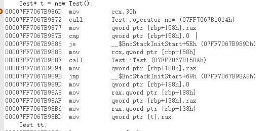

## C++中new，operator new和placement new的区别

### 1 仔细思考new

首先，new是一个关键字。他不能重载。

在使用了new关键字之后发生了什么事情？

```
A *a = new A();
```

参照侯捷老师的内存管理课程，实际上这里的new发生了三个过程（其实也可以看作两个过程）

1. 调用operator new，分配大小为A类占用内存的空间
2. 调用构造函数
3. 返回相应指针

```
A* a;

void *raw = operator new(sizeof A);

try{
	p = new(raw) A();
}catch(...){
	//一个exception发生
	oprator delete(raw);
	throw;	
}
```

所以，执行new的时候实际发生了2件事，先申请内存，之后调用构造函数；执行delete其实就相当于先执行了析构之后再operator delete

另外可以直接声明这个类

```
class TT{};

TT tt;

TT *t = new TT;
```

这里涉及到操作系统的内存模型，简单讲就是new是动态的再堆上分配的内存，需要coder手动去释放，不用new的生存空间在栈上，离开作用域之后会自动回收。

另外要区别一下::new和new，如果::new是全局默认的new关键字，哪怕重载operatorn new之后依然可以适用最初的方式分配内存。

### 2 再探operator new

new简单的讲就是一层对于operator new的封装，你什么都不需要直到，需要动态分配的时候直接使用就行了，脏活累活他下层的routine都帮你做了。

#### 2.1 operator new

new的过程拆解之后就是中间调用了一个operator new。这个函数可以重载。一般情况下，分配内存，失败的话就调用一个newhandler，重复前面的过程，成功的时候返回。如果一个类没有重载operator new的话，那么他的new调用的就是全局的`::operator new`

```
using namespace std;
class Test
{
public:
    // 在类中重载operator new
    void* operator new(size_t size)
    {
		cout << "call a overload new func" << endl;
        return ::operator new(size);
    }
};

```


重载全局的`::operator new`是可行的，只不过基本没见过。

```
void* operator new(size_t size)
{
    cout << "global change" << endl;
    return malloc(size);
}
```

实际情况下就只能用malloc去做分配了。

当在自己设计的类中重载了这operator new和operator delete之后，再次调用new分配一个设计类的时候，就会调用内部的routine。


```
#pragma
#include <iostream>
#include <string>
using namespace std;

class Test {
public:
	Test():id(0),name("NAN") {}
	~Test() {}
	//这里默认是static的，加不加都可以
	void* operator new(size_t);
	void operator delete(void* ,size_t);
public:
	int id;
	string name;
};

void* Test::operator new(size_t size) {
	cout << "QAQ1" << endl;
	return malloc(size);
}

void Test::operator delete(void* ptr, size_t size) {
	cout << "^_^" << endl;
	free(ptr);
}

int main() {
	Test* t = new Test();
	Test tt;
	delete t;
	cout << sizeof t << endl;
	cout << sizeof * t << endl;
	cout << sizeof tt.name << endl;
	cout << sizeof tt.id << endl;
}
```

实际的调试代码

### 2.2 placement new

这里关注之后的一步，构造。placement new的用法比较奇怪。实际上也很少被用到。

```
p = new(raw) Foo();
```

这里其实是更加定制化的操作。new分两步走，这是我们前面已知的。已经有一块内存了，我们自然可以想到能不能保有这一块地址，不断的构造析构？

比较坑的是c++大部分的编译器是不允许你直接用这个指针调用构造函数的，侯捷老师只在vc6上成功过。我没有尝试过。

```
p->Foo::Foo();//大部分编译器会爆一个directly什么的错
```

实际上，malloc会导致系统调用，陷入内核态。C++标准也是这么想的，之后就提供了placement new。实际上，使用placement new需要加一个头文件。

最后看一下汇编的代码,有两个call。这也符合前文所描述的过程。




那，再往前想一点，有没有placement delete呢？

在delete的时候，我们做一个释放内存的操作。如果我在placement new上工作的话，delete的时候会把这个placement new的内存释放。那为什么不直接析构？我们用placement new就是为了效率。

```
Point* p = new (arena) Point;
// do something
// manipulate a new object
delete p; // Wrong. You release the arena memory
p = new (arena) Point;

// correct method

p->~P();
p = new (arena) Point;
```

但是，如果在placement new失败的时候呢？这个时候为了防止内存泄漏，实际上要清理掉分配的内存

这里其实是有placement function的,但是你不会直接能调用到而已.给你用到只有delete和delete[].

实际的分析可以参考蓝色的答案,但实际我用msvc19复现的时候已经不会有placement delete的function语义出现了.


