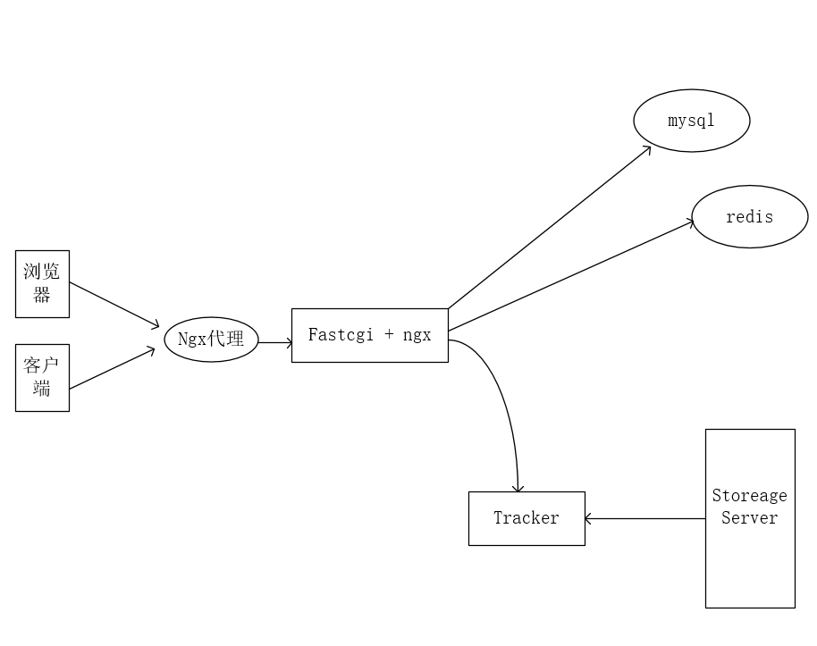
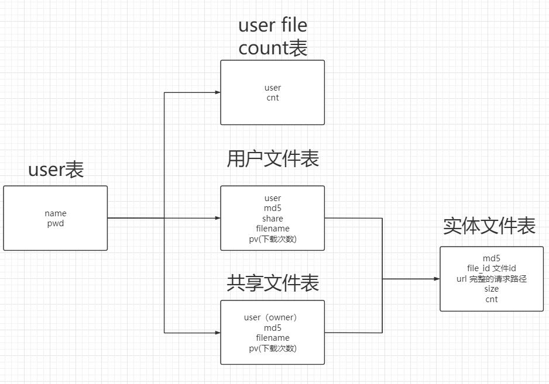

## LeptCloud

LeptCloud是一个支持分布式存储的高负载解决方案。项目中涉及到了的常见中间件，和一些开发的常见工具。在研发的路径中收获良多，记录若干。

### 开门见山

在Leptcloud中，我使用fastdfs作为文件储存系统，nginx反向代理相关请求到端口，通过fastcgi的后台进程持续处理。mysql维护我的用户信息，redis维护登录的token减小存储的压力。

### 关于选型和瓶颈测试

这里的项目仅仅作为自己的练习和熟悉相关开发流程的学习之用，并没有涉及到超大规模的并发设计。在压测中，理论和经验情况下，常规服务器下支持10w人的并发还是没有问题的。

如何压测？后续会更新压测和瓶颈的分析，有些是利用code测试实现，有些会用wrk做压测。

### 项目文档和构架简析

整体构架图如上，详细记录会在后续讲解。项目实现的服务端代码在同目录的src下。

mysql中记录了用户信息和用户的文件信息，fastdfs中进行文件操作的时候会将记录写入mysql中。

接口文档在同目录下的API文档中

### 如何设计数据表和我的思路以及业务分析

首先给出设计的数据库表：[link](LeptCloud.sql)

数据表比较繁杂，这里我站在高处点一下全部的过程，而且这些表的设计是为了业务流程服务的。下载是用md5来唯一请求到url的。

首先，file_info表是描述一个文件储存的，他有如下的参数：

1. md5：文件的  md5 值，文件上传先可以先匹对数据库是否存在相同的 md5 值，如果存在意味着是同一文件。
2. file_id：文件  id，对应  fastdfs 的文件路径，下载的时候请求会打到这个路径
3. url：文件的完整存储路径，比如  192.168.52.139:80/group1/M00/00/00/xxx.png
4. count：文件引用计数，每增加一个用户拥有此文件，此计数器+1

之后还有一个共享表，表中维护一下几个字段：

1. user：文件所属用户
2. md5：对应的 md5 值
3. file_name：文件名
4. pv：文件下载量，方便按照下载量排序

登录的时候主要用到user_info表去查询：

1. user_name：用户名，唯一
2. password：密码，md5 加密

-------------

接下来简单的分析一下业务的实现，首先是注册，详细看代码reg_cgi.c,里面的流程主要：

1. post注册信息（client）
2. 查mysql，成功回复json数据

在这个过程中，密码是用md5加密过的，储存在数据库中的也是加密过的密码。

之后就是登录的功能，在login_cgi.c中实现：

1. post相关信息，mysql验证
2. 生成token，并在回复中附上token

关于token的作用，我在这里做一个密钥类似的作用，做一个身份验证的功能。这样在服务端就不用做我的身份登录的记录（注意我设置了token的实现时长，setex），我在此简要描述一下带token的服务端验证：

1. 客户端每次向服务端请求的时候需要带着token
2. 服务端收到请求，去验证token，如果验证一致，返回请求的数据。

注意看到login中，我过了一步base64，主要是为了处理编码的问题，有些不可见字符可能会出现被误处理的问题。

再就是文件上传的流程：

1. 每个文件都有唯一的md5值，就像身份证号一样。client在上传文件之前将md5传到服务器上与之一起的还post一个token，做验证用
2. 服务器判断是否有这个，有的话在file_info表中将cnt++
3. 反之就需要上传了

还有就是获取文件列表：

1. 首先会请求到文件数目
2. 之后再post我的文件列表起点和count，去请求文件列表

分享文件流程：

1. 要在share表中看看有没有share过，有的话 + 1没有的话分享

2. 获取分享文件和获取文件列表类似

处理文件：

1. 删除需要判断是否已删除，是否有文件，是否已经分享（redis中可能存着分享的信息）。之后删除数据库相关的记录
2. 分享需要在redis中看set中有没有分享记录，没有的话就去mysql中将表user_file_list中分享字段,之后更新redis中的记录

还剩下一些功能可以评价代码详细查看，不再一一赘述。

#### 最后总的看一下redis做的事情

1. token
2. 下载排行（file_pub_zset）
3. 快速获取文件名（k:md5 + 文件名，v:文件名）,主要是为了但是文件名一致，md5不一致情况。

### [分布式文件系统详解]()

 ### [高负载nginx设计]()

### Q&A

+ 云盘多⼤上传量，⾼峰期能到多少
+ 同⼀个group⾥的storage如何做同步
+ 不同group⾥的storage能否做同步
+ 存储的storage服务器宕机了，其他storage如何同步？
+ 如何防⽌盗链
+ FastDFS如何应对单点故障
+ 能否⽀持断点续传？如何实现？
+ 能否⽀持⼩⽂件合并
+ 如何实现负载均衡

