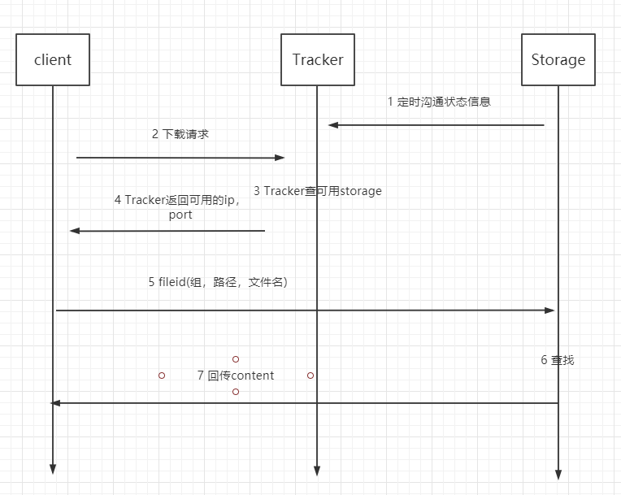

## FASTDFS

Tracker可以和storeage搭建在一台上。一般瓶颈都在Storage上（我听说的）

### FastDFS简单分析

FastDFS主要的功能包括：⽂件存储，同步和访问，设计基于⾼可⽤和负载均衡。FastDFS⾮常适⽤于基 于⽂件服务的站点。但是不推荐存储超大文件（意思就是不要存高清电影之类的，存点小视频还是可以的）

FastDFS由跟踪服务器（tracker server）、存储服务器（storage server）和客户端（client）三个部 分组成，主要解决海量数据存储问题，特别适合以中⼩⽂件（建议范围：4KB < file_size < 500MB）为 载体的在线服务，例如图⽚分享和视频分享⽹站。

这里主要看看它里面的三个角色，跟踪服务器(tracker server)、存储服务器(storage server)和客户端(client)

#### Tracker server

Tracker是FastDFS的协调者，负责管理所有的storage server和group，每个storage在启动后会连接 Tracker，告知⾃⼰所属的group等信息，并保持周期性的⼼跳，tracker根据storage的⼼跳信息，建⽴ group==>[storage server list]的映射表。

Tracker需要管理的元信息很少，会全部存储在内存中；另外tracker上的元信息都是由storage汇报的信 息⽣成的，本身不需要持久化任何数据，这样使得tracker⾮常容易扩展，直接增加tracker机器即可扩展 为tracker cluster来服务，cluster⾥每个tracker之间是完全对等的，所有的tracker都接受stroage的⼼ 跳信息，⽣成元数据信息来提供读写服务。

#### Storage server

Storage server（后简称storage）以组（卷，group或volume）为单位组织，⼀个group内包含多台 storage机器，数据互为备份，存储空间以group内容量最⼩的storage为准，所以建议group内的多个 storage尽量配置相同，以免造成存储空间的浪费。（组内storage的内容相同，不同组内容不同）

以group为单位组织存储能⽅便的进⾏应⽤隔离、负载均衡、副本数定制（group内storage server数量即 为该group的副本数），⽐如将不同应⽤数据存到不同的group就能隔离应⽤数据，同时还可根据应⽤的访问特性来将应⽤分配到不同的group来做负载均衡；缺点是group的容量受单机存储容量的限制，同时当 group内有机器坏掉时，数据恢复只能依赖group内地其他机器，使得恢复时间会很⻓。（就是木桶短板原理）

group内每个storage的存储依赖于本地⽂件系统，storage可配置多个数据存储⽬录，⽐如有10块磁盘， 分别挂载在/data/disk1-/data/disk10，则可将这10个⽬录都配置为storage的数据存储⽬录。（一台机器只能配一个stroage，两个网卡也只能陪一个）

storage接受到写⽂件请求时，会根据配置好的规则，选择其中⼀个存储⽬录来存储⽂件。为了避免单个⽬ 录下的⽂件数太多，在storage第⼀次启动时，会在每个数据存储⽬录⾥创建2级⼦⽬录，每级256个，总 共65536个⽂件，新写的⽂件会以hash的⽅式被路由到其中某个⼦⽬录下，然后将⽂件数据直接作为⼀个 本地⽂件存储到该⽬录中。

#### Client

FastDFS向使⽤者提供基本⽂件访问接⼝，⽐如monitor、upload、download、append、delete等，以客户端库的⽅式提供给⽤户使⽤。

### upload

**选择tracker server**

当集群中不⽌⼀个tracker server时，由于tracker之间是完全对等的关系，客户端在upload⽂件时可以任意选择⼀个trakcer。

**选择存储的group**

当tracker接收到upload file的请求时，会为该⽂件分配⼀个可以存储该⽂件的group，⽀持如下选择 group的规则：

1. Round robin，所有的group间轮询
2. Specified group，指定某⼀个确定的group
3. Load balance，选择最⼤剩余空间的组上传⽂件

**选择storage server**

当选定group后，tracker会在group内选择⼀个storage server给客户端，⽀持如下选择storage的规则：

1. Round robin，在group内的所有storage间轮询
2. First server ordered by ip，按ip排序
3. First server ordered by priority，按优先级排序（优先级在storage上配置）

**选择storage path**

当分配好storage server后，客户端将向storage发送写⽂件请求，storage将会为⽂件分配⼀个数据存储目录，⽀持如下规则：

1. Round robin，多个存储⽬录间轮询
2. 余存储空间最多的优先

**⽣成Fileid**

选定存储⽬录之后，storage会为⽂件⽣⼀个Fileid，由：storage server ip、⽂件创建时间、⽂件⼤⼩、 ⽂件crc32和⼀个随机数拼接⽽成，然后将这个⼆进制串进⾏base64编码，转换为可打印的字符串。

**选择两级目录**

当选定存储⽬录之后，storage会为⽂件分配⼀个fileid，每个存储⽬录下有两级256*256的⼦⽬录， storage会按⽂件fileid进⾏两次hash（猜测），路由到其中⼀个⼦⽬录，然后将⽂件以fileid为⽂件名存 储到该⼦⽬录下。

**生成文件名**

当⽂件存储到某个⼦⽬录后，即认为该⽂件存储成功，接下来会为该⽂件⽣成⼀个⽂件名，⽂件名由： group、存储⽬录、两级⼦⽬录、fileid、⽂件后缀名（由客户端指定，主要⽤于区分⽂件类型）拼接⽽ 成。

### download file

客户端upload file成功后，会拿到⼀个storage⽣成的⽂件名，接下来客户端根据这个⽂件名即可访问到 该⽂件。

tracke从⽂件名中解析出⽂件的 group、⼤⼩、创建时间等信息,然后为该请求选择⼀个storage⽤来服务读请求。

### HTTP下载

配置nginx + fastdfs-nginx-module实现下载

### 同步

同⼀组内storage server之间是对等的，⽂件上传、下载、删除等操作可以在任意⼀台storage server上 进⾏；

⽂件同步只在同组内的storage server之间进⾏，采⽤push⽅式，即源服务器同步给⽬标服务器；

### 还有些啥FS

感觉GlusterFS和Ceph也挺有意思
