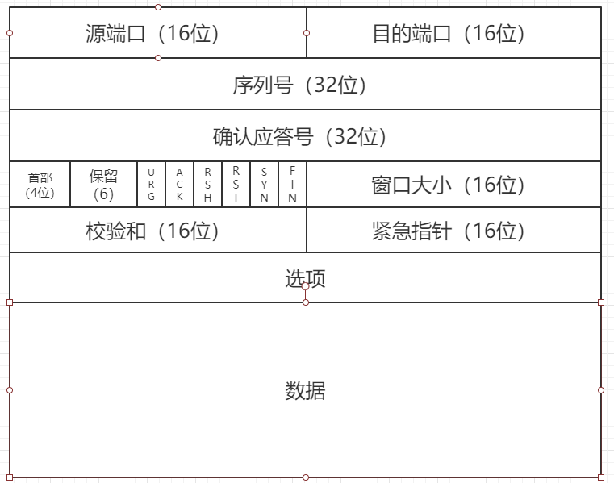

## TCP/UDP的基本

IP 层是「不可靠」的，它不保证⽹络包的交付、不保证⽹络包的按序交付、也不保证⽹络包中的数据的完整性。

### 头格式



1. 序列号：在建⽴连接时由计算机⽣成的随机数作为其初始值，通过 SYN 包传给接收端主机，每发送⼀次数据，就 「累加」⼀次该「数据字节数」的⼤⼩。⽤来解决⽹络包乱序问题。
2. 确认应答号：指下⼀次「期望」收到的数据的序列号，发送端收到这个确认应答以后可以认为在这个序号以前的数 据都已经被正常接收。⽤来解决不丢包的问题。
3. 控制位：
   + ACK：该位为1时，「确认应答」的字段变为有效，TCP 规定除了最初建⽴连接时的SYN 包之外该位必须 设置为1 。
   + RST：该位为1时，表示TCP连接中出现异常必须强制断开连接。
   + SYN：该位为1时，表示希望建⽴连接，并在其「序列号」的字段进⾏序列号初始值的设定。
   + FIN：该位为1 时，表示今后不会再有数据发送，希望断开连接。当通信结束希望断开连接时，通信双⽅的主机之间就可以相互交换FIN 位为1的 TCP 段。

注意TCP是有可变长字段的，所以他也有首部长度的字段。

### TCP连接

建立TCP连接需要三个信息的公式：

+ Socket：由 IP 地址和端⼝号组成
+ 序列号：⽤来解决乱序问题等
+ 窗⼝⼤⼩：⽤来做流控制

而一个四元组能够唯一的确定一个TCP连接，src地址，dst地址，src端口号，dst端口号。

源地址和⽬的地址的字段（32位）是在 IP 头部中，作⽤是通过 IP 协议发送报⽂给对⽅主机。

源端⼝和⽬的端⼝的字段（16位）是在 TCP 头部中，作⽤是告诉 TCP 协议应该把报⽂发给哪个进程。

理论上来讲，一个端口的TCP连接时可以按照四元素的大小乘出来的，但是实际情况下并不能到达系统的上限，这和两个原因有关：

1. ⾸先主要是⽂件描述符限制，Socket 都是⽂件，所以⾸先要通过     ulimit 配置⽂件描述符的数⽬
2. 另⼀个是内存限制，每个 TCP 连接都要占⽤⼀定内存，操作系统的内存是有限的。

### 再来看看UDP的头部信息


UDP 不提供复杂的控制机制，利⽤ IP 提供⾯向「⽆连接」的通信服务。细看好像就是IP之上做一个接口封装。

+ ⽬标和源端⼝：主要是告诉 UDP 协议应该把报⽂发给哪个进程
+ 包⻓度：该字段保存了 UDP ⾸部的⻓度跟数据的⻓度之和。
+ 校验和：校验和是为了提供可靠的 UDP ⾸部和数据⽽设计

### TCP和UDP的区别

主要从7个方面讨论：

1. 连接形式

2. 服务对象

3. 可靠

4. 拥塞控制

5. 首部开销

6. 传输方式（UDP是一个个包的发送的，是有边界的。可能丢包的）

7. 分片

   > 1. TCP 的数据⼤⼩如果⼤于 MSS ⼤⼩，则会在传输层进⾏分⽚，⽬标主机收到后，也同样在传输层组装 TCP 数据包，如果中途丢失了⼀个分⽚，只需要传输丢失的这个分⽚。
   >
   > 2. UDP 的数据⼤⼩如果⼤于 MTU ⼤⼩，则会在 IP 层进⾏分⽚，⽬标主机收到后，在 IP 层组装完数据，接着再 传给传输层，但是如果中途丢了⼀个分⽚，在实现可靠传输的  UDP 时则就需要传所有的数据包，这样传输 效率⾮常差，所以通常 UDP 的报⽂应该⼩于 MTU。

### 应用场景简单分析

TCP：

1. FTP文件传输
2. httpx

UDP，可以随时手法数据，加上本身是高效的，所以可以：

1. 轻量级通信
2. 音视频
3. 广播

### 总结

这里看概念总感觉比较单调，不如实现一下TCP的数据结构吧

首先UDP的比较简单

```
struct udphdr {
	unsigned short source;
	unsigned short dest;
	unsigned short len;
	unsigned short check;
};
```

之后TCP的，这里考虑了大小端序的问题

```
typedef struct _tcp_hdr  
{  
    unsigned short src_port;    //源端口号  
    unsigned short dst_port;    //目的端口号  
    unsigned int seq_no;        //序列号  
    unsigned int ack_no;        //确认号  
    #if LITTLE_ENDIAN //端序问题 
    unsigned char reserved_1:4; //保留6位中的4位首部长度  
    unsigned char thl:4;        //tcp头部长度  
    unsigned char flag:6;       //6位标志  
    unsigned char reseverd_2:2; //保留6位中的2位  
    #else  
    unsigned char thl:4;        //tcp头部长度  
    unsigned char reserved_1:4; //保留6位中的4位首部长度  
    unsigned char reseverd_2:2; //保留6位中的2位  
    unsigned char flag:6;       //6位标志   
    #endif  
    unsigned short wnd_size;    //16位窗口大小  
    unsigned short chk_sum;     //16位TCP检验和  
    unsigned short urgt_p;      //16为紧急指针  
}tcp_hdr;
```

