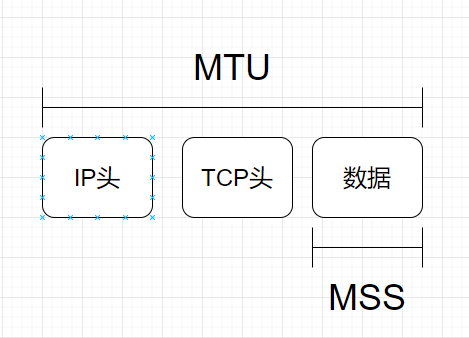

## 看Linux的TCP三次握手实现

TCP经常问到的有三次握手，四次挥手，滑动窗口，慢启动，拥塞控制等方面。但是实际情况下，参考了一些文章之后发现，复杂变化下的网络，TCP的机制会随之做着适应的变化。这里我会参考Linux的5.3版本的源码，看一下具体的实现问题。

### TCP的可靠连接

首先直接的讲，在传输层的TCP协议，是在IP协议的基础上实现一个面向连接，可靠的传输协议。IP的交付本身就是无连接和不可靠的。这里在面试中也常问的问题，TCP和UDP的区别。UDP只是简单的在IP协议层的上方加了一个传输层的端口封装，他就直接继承了IP协议的一些特性和问题。

其次，理解网络协议我们应该站在一个设计者的角度去思考问题。为什么要面向连接？为什么要可靠？怎么做到可靠？

首先，了解面向连接，既是一个连接中，传输的数据要关心状态，对端的状态（等待或者接收？）。需要维护数据流的顺序。

其次，无连接就不用关心对方在不在线，每个数据都是独立体，无需维护关系和状态问题。

典型的打电话和发短信之间的关系。

建立连接->传输->断开连接,这里的三步就创建了一个长连接，在同一个连接中，数据是有上下文关系的。

1. 你需要维护一个seq号，保证他的顺序交付和去重
2. 需要状态标识维护连接的状态：ack,syn,fin,rst

这个连接的可靠性问题靠什么解决：

1. 数据传输确认，数据发送后等待对方确认。需要维护确认字段Acknowledgement和ack状态。这就是停止等待协议。
2. 1中的传输确认，会造成带宽利用率不高的问题，解决方案就是引入一个滑动窗口 + 窗口确认机制，在多个包发送之后进行一次确认。

那么，之后需要关心的就是如何确认窗口大小，fit当前网络的时延？

1. 窗口变量
2. 窗口检测报告

对于发送发，你需要维护

1. 已发送并确认的ack偏移量（左边界，left border）
2. 已发送，但是没有确认的ack偏移量（窗口当前发送字节的位置）
3. 即将发送的偏移量（右边界）

对于接收方：

1. 已经收，并确认的偏移（左边界）
2. 接收后会保存的窗口大小（右边界）

接受方给发送发回复ack确认，ack中会有最新窗口告知长度。这样发送方就能调整窗口长度。此处会引入sack选择确认行为和窗口为0时的坚持定时器行为。

这里暂时解决了演示的问题，但是网络是复杂的，随时可能因为大数据包而导致网络的阻塞，于是引入拥塞控制机制：当拥塞出现的时候，tcp应该保证每一条连接都能够公平的share带宽。就是每条尽量达到一个传输速率。

拥塞控制就是调整窗口大小来实现的，需要在接收短引入一个cwnd，拥塞窗口的变量，反映的是当前网络的传输能力，之前接收端告诉发送端的awnd。此时，发送短实际可以用的窗口就是min(cwnd,awnd)

这里有几个小问题：

1. 如何查看TCP状态

   > `netstat -napt`

### 具体的包

首先关注到第一个报文，syn，注意参考tcp中我写道的tcp的数据头格式。这里的序列号会随机初始化一个，syn位会置为一


第二个报文回来，服务端也会随机一个序列号，确认应答号是在前面的客户端的序列号+1的，syn和ack置1

最后第三次握手的时候，是可以携带数据的，前两次握手是不可以的

### 三次握手和为什么？

原因：

1. 确认是在线，能给我反馈
2. 确认起始seq，因为连接数据多的话，要保证两边顺序。数据全双工，连边都要知道对方的序列号。

第二点比较能够好的解释原因，我要让两边都知道序列号啊。左边从LX开始，右边从RY开始。


关于服务端如何唯一的确认这个客户端的连接，即如何确定，这个ack是第一个发给我的还是之前已经发过syn，我接受了回复了ack+syn。服务端会在内核中查询四元组，在tcp_v4_rcv()中进行,调用inet_lookup查找。

```
static inline struct sock *__inet_lookup(struct net *net,
                                         struct inet_hashinfo *hashinfo,
                                         struct sk_buff *skb, int doff,
                                         const __be32 saddr, const __be16 sport,
                                         const __be32 daddr, const __be16 dport,
                                         const int dif, const int sdif,
                                         bool *refcounted)
{
        u16 hnum = ntohs(dport);
        struct sock *sk;

        sk = __inet_lookup_established(net, hashinfo, saddr, sport,
                                       daddr, hnum, dif, sdif);
        *refcounted = true;
        if (sk)
                return sk;
        *refcounted = false;
        return __inet_lookup_listener(net, hashinfo, skb, doff, saddr,
                                      sport, daddr, hnum, dif, sdif);
}
```

流程就是先找est中有没有连接，再找listen中有没有连接，没得就返回rst。确认连接存在，且处于est，直接tcp_rcv_established()接受数据，否则进入tcp_rcv_state_process()。如果在第一次握手，进入acceptable = icsk->icsk_af_ops->conn_request(sk, skb) >= 0;

此时conn_request为tcp_v4_conn_request()，在这个方法中进行第一次握手的处理。如果是第三次握手，此时tcp状态应为：TCP_SYN_RECV。

### 关于MTU和MSS



