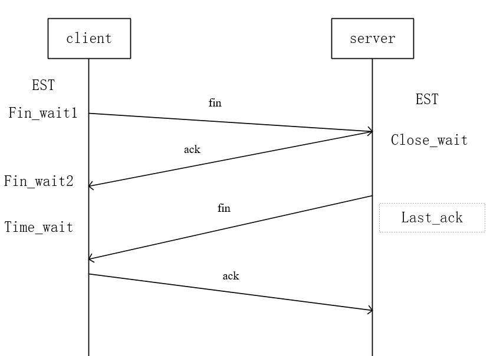

## Tcp的四次挥手

考虑四次挥手的原因，和什么时候会变成三次挥手

相关的关闭连接状态

如何解决各种状态驻留过多导致的问题

### 为什么要四次挥手？

对于这种全双工的连接来说，四次挥手比较自然。一方主动断开连接，发fin，对方发ack确认。另一方也要交互一次，这样一个连接才能被close。

这里记录一下中间的两个包能不能合并的问题。



可以合并，但是一般来说不行，具体应该由业务实现。

实际情况中，可以简化成三次挥手。Linux支持延迟ack机制，第一个fin收到之后，发送ack的条件不满足立即发送，ack被延时发送，确认了数据没有要发的情况下，要关闭这个连接，可以缩短成一次。

所以正确的四次挥手的答案就是，可以，但是大多数情况下三挥手也够用了。

### 关于time_wait

time_wait主要为处理最后一次ack丢失的话，对面重传一个fin，我要能重传一个ack。RFC规定要等待两倍的MSL（一个数据分片（报文）在网络中能够生存的最长时间），这个时间也被RFC规定为2分钟。但是实际Linux的实现并不用等这么久

TIME_WAIT状态只出现在主动关闭方，如果服务器上TIME_WAIT状态连接很多的话，需要占用较大的slab内存资源。Linux的实现中，TCP_TIME_WAIT等待时间被固定设置为60秒。然后还可能回占用很多端口资源，端口就65536个，用完了可就无法接受连接了。

### time_wait是否可以提前收回

Linux支持对TIME_WAIT状态的reuse，更早版本的内核还支持recycle，这两种机制都可以让TIME_WAIT状态被提前回收。

主动断开连接的一般都是服务端，服务端上比较容易产生大量的TIME_WAIT状态连接的残留。如果它们影响到你的服务器性能的话，第一手段是考虑减少/proc/sys/net/ipv4/tcp_max_tw_buckets。客户端处于last_ack久一点无所谓的。

这里给出一个优化的方式

1. 打开 net.ipv4.tcp_tw_reuse 和 net.ipv4.tcp_timestamps 选项；
2. net.ipv4.tcp_max_tw_buckets
3. 程序中使⽤ SO_LINGER ，应⽤强制使⽤ RST 关闭。

方式一中，

```
net.ipv4.tcp_tw_reuse = 1
```

可以复⽤处于 TIME_WAIT 的 socket 为新的连接所⽤。

有⼀点需要注意的是，tcp_tw_reuse 功能只能⽤客户端（连接发起⽅），因为开启了该功能，在调⽤ connect() 函数时，内核会随机找⼀个 time_wait 状态超过 1 秒的连接给新的连接复⽤。

然后还需要,下面这个参数默认为一，保险还是看一眼

```
net.ipv4.tcp_timestamps=1
```

这个时间戳的字段是在 TCP 头部的「选项」⾥，⽤于记录 TCP 发送⽅的当前时间戳和从对端接收到的最新时间 戳。

方式2中，net.ipv4.tcp_max_tw_buckets

这个值默认为 18000，当系统中处于 TIME_WAIT 的连接⼀旦超过这个值时，系统就会将后⾯的 TIME_WAIT 连接 状态重置。有点清真，不推荐。

方式3中，程序中用，设置socket 选项，来设置调⽤ close 关闭连接⾏为。

```
struct linger so_linger; 
so_linger.l_onoff = 1; 
// 如果l_onoff 为⾮ 0 && l_linger值为0，那么调⽤close后，会⽴该发送⼀个RST标志给对端
so_linger.l_linger = 0;
setsockopt(s, SOL_SOCKET, SO_LINGER, &so_linger,sizeof(so_linger));
```

这种回跳过4挥状态。

### 总结

服务器上任何一种状态驻留时间过长、累积量过大都会对系统性能造成影响，最严重的结果就是耗尽内存或者四元组空间，导致拒接服务。

