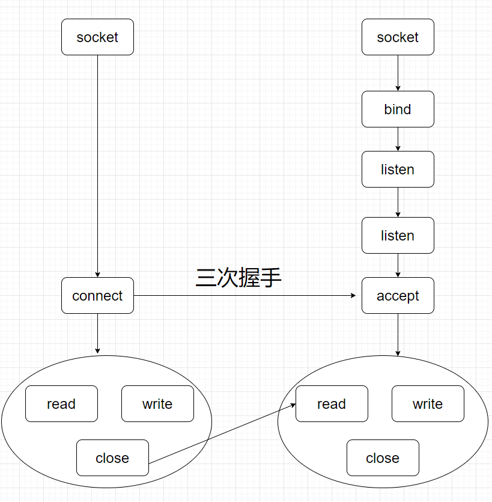

## 记录一下socket编程相关



服务端调⽤ accept 时，连接成功了会返回⼀个已完成连接的 socket，后续⽤来传输数据

服务端

```
#include <sys/socket.h>
#include <netinet/in.h>
#include <arpa/inet.h>
#include <assert.h>
#include <stdio.h>

#include <unistd.h>
#include <errno.h>
#include <string.h>

int main(int argc,char *argv[]){
    if(argc < 2){
        //printf()
        return 1;
    }
    const char* ip = argv[1];
    int port = atoi(argv[2]);


    struct sockaddr_in address;
    bzero(&address,sizeof address);
    address.sin_family = AF_INET;
    inet_pton(AF_INET,ip,&address.sin_addr);//ip绑一下
    address.sin_port = htons(port);

    int sock = socket(PF_INET,SOCK_STREAM,0);
    assert(sock >= 0);

    int ret = bind(sock,(struct sockaddr*)&address,sizeof address);
    assert(res != -1);

    ret = listen(sock,5);//backlog取经典值5
    assert(ret != -1);

    sleep(20);//睡20，等待连接的相关操作

    //accept,远端的socket信息
    struct sockaddr_in client;
    socklen_t client_len = sizeof(client);
    int connfd = accept(sock,(struct sockaddr*)&client,&client_len);

    if(connfd < 0){
        printf("errno:%d\n",errno);
    }else{
        //成功连接，打出端口号和ip
        char remote[INET_ADDRSTRLEN];
        printf("ip:%s,port:%d",inet_ntop(AF_INET,&client.sin_addr,remote,client_len),ntohs(client.sin_port));
        close(connfd);//关闭连接
    }
    close(sock);
    return 0;
}
```

客户端

```
#include <sys/socket.h>
#include <netinet/in.h>
#include <arpa/inet.h>
#include <assert.h>
#include <stdio.h>
#include <unistd.h>
#include <string>
#include <stdlib.h>

//发送和接受带外数据
int main(int argc,char * argv[]){
    if(argc <= 2){
        printf("usgae: %s is ip_address port_number\n",basename(acgv[0]));
        return 1;
    }
    const char *ip = argv[1];
    int port = atoi(argv[2]);
    struct sockaddr_in  server_address;
    bzero(&server_address,sizeof server_address);
    server_address.sin_family = AF_INET;//tcp ipv4
    inet_ntop(AF_INET,ip,&server_address.sin_addr);
    server_address.sin_port = htons(port);

    int sockfd = socket(PF_INET,SOCK_STREAM,0);
    assert(sockfd >= 0);
    if(connect(sockfd,(struct sockaddr*)&server_address,sizeof server_address) < 0){
        printf("connection failed\n");
    }else{
        const char* obb_data = "abc";
        const char* nomal_data = "123";
        send(sockfd,nomal_data,strlen(nomal_data),0);
        send(sockfd,obb_data,strlen(obb_data),MSG_OOB);
        send(sockfd,nomal_data,strlen(nomal_data),0);
    }
    close(sockfd);
    return 0;
}
```

