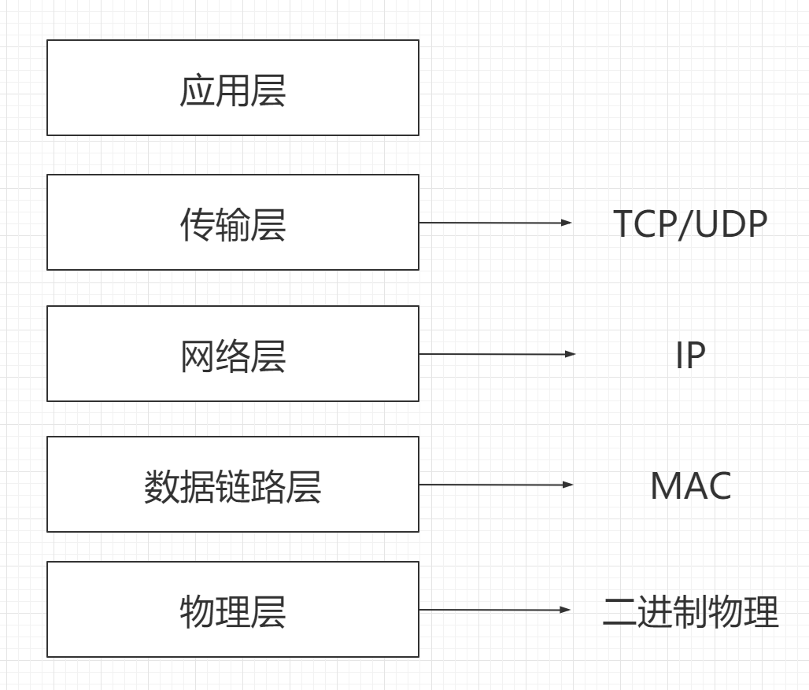

## 网络模型

为了兼容多样设备等原因，一套完整的网络通信协议被协商出来

### 应用层

两个不同设备的应⽤需要通信的时候，应⽤就把应⽤数据传给下⼀层，也就是传输层。我们只用专心关注应用层的实际实现，不必关心如何交付的问题

应⽤层是⼯作在操作系统中的⽤户态，传输层及以下则⼯作在内核态。

常见的有http之类的。

### 传输层

应⽤层的数据包会传给传输层，传输层（Transport Layer）是为应⽤层提供⽹络⽀持的。

在传输层会有两个传输协议，分别是 TCP 和 UDP。

TCP 的全称叫传输层控制协议（Transmission Control Protocol），⼤部分应⽤使⽤的正是 TCP 传输层协议，⽐ 如 HTTP 应⽤层协议。TCP 相⽐  UDP 多了很多特性，⽐如流控制、超时传、拥塞控制等，这些都是为了保证 数据包能可靠地传输给对⽅。

UDP 就相对很简单，简单到只负责发送数据包，不保证数据包是否能抵达对⽅，但它实时性相对更好，传输效率 也⾼。当然，UDP 也可以实现可靠传输，把 TCP 的特性在应⽤层上实现就可以，不过要实现⼀个商⽤的可靠 UDP 传输协议，也不是⼀件简单的事情。

应⽤需要传输的数据可能会⾮常⼤，如果直接传输就不好控制，因此当传输层的数据包大小超过 MSS（TCP 最⼤ 报⽂段⻓度） ，就要将数据包分块，这样即使中途有⼀个分块丢失或损坏了，只需要新这⼀个分块，⽽不⽤新 发送整个数据包。在 TCP 协议中，我们把每个分块称为⼀个 TCP 段（TCP Segment）。

接收方接受数据的时候，传输层则要负责把数据包传给应⽤，但是接收方可能会有很多应用在接收或者传输数 据，因此需要⽤⼀个编号将应⽤区分开来，这个编号就是端⼝。

80 端⼝通常是 Web 服务器⽤的，22 端⼝通常是远程登录服务器⽤的。⽽对于浏览器（客户端）中的每个标签栏都是⼀个独⽴的进程，操作系统会为这些进程分配临时的端⼝号。

一个四元组就能唯一的标识一个请求了。

### 网络层

实际上网络层做的事情有点玄学，实际的传输功能中的部分是交给了网络层的，仔细看UDP的话其实就是IP的一个封装。这也说明了在传输层不希望做太复杂的设计，只需要负责好通信的事情就可以了。网络层负责讲数据传输的实现具体化一下。

⽹络层最常使⽤的是 IP 协议（Internet Protocol），IP 协议会将传输层的报⽂作为数据部分，再加上 IP 包头组装 成 IP 报⽂，如果 IP 报⽂⼤⼩超过 MTU（以太⽹中⼀般为 1500 字节）就会再次进⾏分⽚，得到⼀个即将发送到⽹ 络的 IP 报⽂。

⽹络层负责将数据从⼀个设备传输到另⼀个设备，具体的设备识别就是利用ip编号。但是设备如此之多，实际上的一个个匹配时很不现实的

因此，需要将 IP 地址分成两种意义：

1. ⽹络号，负责标识该 IP 地址是属于哪个⼦⽹的；
2. 主机号，负责标识同⼀⼦⽹下的不同主机；

实际操作的时候，需要配合⼦⽹掩码才能算出 IP 地址的网络号和主机号。那么在寻址的过程中，先匹配到相同的网络号，才会去找对应的主机

 IP 协议还有另⼀个要的能⼒就是路由，需要根据实际的子网掩码计算和arp解析决定下一个路径往哪里走

### 数据链路层

网络可以被划分成多个子网和区块

⼀旦数据需要跨网络传输，就需要有⼀个设备同时在两个⽹络当中，这个设备⼀般是路由器，路由器可以通过路由表计算出下⼀个要去的 IP 地址。

那么怎么通过ip找到设备？这里就需要ma地址的帮助，数据链路层就主要提供了链路级别的传输服务。

每⼀台设备的⽹卡都会有⼀个 MAC 地址，它就是⽤来唯⼀标识设备的。路由器计算出了下⼀个⽬的地 IP 地址，再通过 ARP 协议找到该⽬的地的 MAC 地址（广播），这样就知道这个 IP 地址是哪个设备的了。

### 物理层

二进制电信号的传输。

### 总结

在传输过程中，一层层的加入协议头，在接受的过程中，一层层的解析头部。分层概念的加入，能够让每一层的关注点留在每一层的业务实现上。

