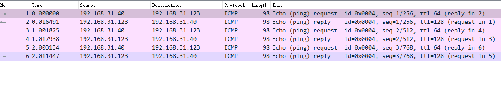

## 抓包

目前接触过的抓包只有两个工具，一个是tcpdump，另一个就是wireshark。其中tcpdump是个命令行工具，wireshark是开源的跨平台工具。比较迷的操作是，tcpdump抓到的文件放到wireshark里分析

### tcpdump

首先ifconfig看看设备信息，之后我ping一下一个服务端，这个服务的协议在ip层，icmp

```
# -I 标识用那个网卡发
# -c 之后标识发送多少个数据包
han@han-server:~$ ping -I wlp5s0 -c 3 192.168.31.123
PING 192.168.31.123 (192.168.31.123) from 192.168.31.40 wlp5s0: 56(84) bytes of data.
64 比特，来自 192.168.31.123: icmp_seq=1 ttl=128 时间=8.91 毫秒
64 比特，来自 192.168.31.123: icmp_seq=2 ttl=128 时间=11.0 毫秒
64 比特，来自 192.168.31.123: icmp_seq=3 ttl=128 时间=10.8 毫秒

--- 192.168.31.123 ping 统计 ---
已发送 3 个包， 已接收 3 个包, 0% 包丢失, 耗时 2003 毫秒
rtt min/avg/max/mdev = 8.913/10.237/10.998/0.939 mss
```

之后tcpdump就能通过加一些参数只看icmp报文

```
# -i 之后标识设备网卡
# icmp 标识需要抓取的协议
# host 标识需要抓取对应的ip地址包
# -nn 表示不解析ip地址和端口号名称
sudo tcpdump -i wlp5s0 icmp and host 192.168.31.123 -nn
```

结果如下

```
tcpdump: verbose output suppressed, use -v or -vv for full protocol decode
listening on wlp5s0, link-type EN10MB (Ethernet), capture size 262144 bytes
22:36:11.331908 IP 192.168.31.40 > 192.168.31.123: ICMP echo request, id 3, seq 1, length 64
22:36:11.340429 IP 192.168.31.123 > 192.168.31.40: ICMP echo reply, id 3, seq 1, length 64
22:36:12.333677 IP 192.168.31.40 > 192.168.31.123: ICMP echo request, id 3, seq 2, length 64
22:36:12.343543 IP 192.168.31.123 > 192.168.31.40: ICMP echo reply, id 3, seq 2, length 64
22:36:13.334857 IP 192.168.31.40 > 192.168.31.123: ICMP echo request, id 3, seq 3, length 64
22:36:13.349975 IP 192.168.31.123 > 192.168.31.40: ICMP echo reply, id 3, seq 3, length 64
```

然后还有一些选项类，可以酌情考虑

| 选项 |       sample        |   explain    |
| :--: | :-----------------: | :----------: |
|  -c  |    tcpdump -c 5     | 限制抓包个数 |
|  -w  | tcpdump -w file.cap | 保存到文件中 |

另外关于过滤表达式

|           选项           |                 sample                  |  explain   |
| :----------------------: | :-------------------------------------: | :--------: |
|           host           |            tcpdump -nn hosst            |  主机过滤  |
|      port，src port      |           tcpdump -nn port 80           |  端口过滤  |
| ip，ip6,arp,tcp,udp,icmp |             tcpdump -nn tcp             |  协议过滤  |
|        and,or,not        |       tcp -nn xxxxxx and port 80        |  逻辑表达  |
|     tcp [tcoflages]      | tcpdump -nn "tcp[tcoflages]&tcp-syn!=0" | 特定包状态 |

### wireshark

我会用-w file保存`.cap`之后再去wireshark做解析，可视化会舒服一点



具体看一个网络包的信息


### 抓包的方式看三次握手

直接看到流量图，选择tcpflows


这里挥手只有三次，应证了我之前在四次挥手里分析的，确实在没有数据发送的时候，ack和fin可以合并成一次

### 一些内核参数

首先是看一下第一次syn重传次数

```
han@han-server:~$ cat /proc/sys/net/ipv4/tcp_syn_retries 
6
```

第二次的syn，ack的重传次数

```
han@han-server:~$  cat /proc/sys/net/ipv4/tcp_synack_retries
5
```

里面还剩下一些参数

```
han@han-server:/proc/sys/net/ipv4$ ls
cipso_cache_bucket_size            ip_dynaddr                        tcp_available_ulp                   tcp_max_orphans       tcp_rx_skb_cache
cipso_cache_enable                 ip_early_demux                    tcp_base_mss                        tcp_max_reordering    tcp_sack
cipso_rbm_optfmt                   ip_forward                        tcp_challenge_ack_limit             tcp_max_syn_backlog   tcp_slow_start_after_idle
cipso_rbm_strictvalid              ip_forward_update_priority        tcp_comp_sack_delay_ns              tcp_max_tw_buckets    tcp_stdurg
conf                               ip_forward_use_pmtu               tcp_comp_sack_nr                    tcp_mem               tcp_synack_retries
fib_multipath_hash_policy          ipfrag_high_thresh                tcp_congestion_control              tcp_min_rtt_wlen      tcp_syncookies
fib_multipath_use_neigh            ipfrag_low_thresh                 tcp_dsack                           tcp_min_snd_mss       tcp_syn_retries
fib_sync_mem                       ipfrag_max_dist                   tcp_early_demux                     tcp_min_tso_segs      tcp_thin_linear_timeouts
fwmark_reflect                     ipfrag_secret_interval            tcp_early_retrans                   tcp_moderate_rcvbuf   tcp_timestamps
icmp_echo_ignore_all               ipfrag_time                       tcp_ecn                             tcp_mtu_probe_floor   tcp_tso_win_divisor
icmp_echo_ignore_broadcasts        ip_local_port_range               tcp_ecn_fallback                    tcp_mtu_probing       tcp_tw_reuse
icmp_errors_use_inbound_ifaddr     ip_local_reserved_ports           tcp_fack                            tcp_no_metrics_save   tcp_tx_skb_cache
icmp_ignore_bogus_error_responses  ip_nonlocal_bind                  tcp_fastopen                        tcp_notsent_lowat     tcp_window_scaling
icmp_msgs_burst                    ip_no_pmtu_disc                   tcp_fastopen_blackhole_timeout_sec  tcp_orphan_retries    tcp_wmem
icmp_msgs_per_sec                  ip_unprivileged_port_start        tcp_fastopen_key                    tcp_pacing_ca_ratio   tcp_workaround_signed_windows
icmp_ratelimit                     neigh                             tcp_fin_timeout                     tcp_pacing_ss_ratio   udp_early_demux
icmp_ratemask                      ping_group_range                  tcp_frto                            tcp_probe_interval    udp_l3mdev_accept
igmp_link_local_mcast_reports      raw_l3mdev_accept                 tcp_fwmark_accept                   tcp_probe_threshold   udp_mem
igmp_max_memberships               route                             tcp_invalid_ratelimit               tcp_recovery          udp_rmem_min
igmp_max_msf                       tcp_abort_on_overflow             tcp_keepalive_intvl                 tcp_reordering        udp_wmem_min
igmp_qrv                           tcp_adv_win_scale                 tcp_keepalive_probes                tcp_retrans_collapse  xfrm4_gc_thresh
inet_peer_maxttl                   tcp_allowed_congestion_control    tcp_keepalive_time                  tcp_retries1
inet_peer_minttl                   tcp_app_win                       tcp_l3mdev_accept                   tcp_retries2
inet_peer_threshold                tcp_autocorking                   tcp_limit_output_bytes              tcp_rfc1337
ip_default_ttl                     tcp_available_congestion_control  tcp_low_latency                     tcp_rmem
```

