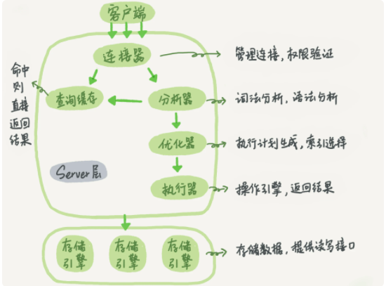

## Know how and why

### 探究一下执行语句的时候实际发生了什么

```
select * from T where ID=10；
```

这一条简答的语句在实际执行的时候，内部经历了那些过程。



参考`mysql`45讲的内容做一下记录。Mysql可分为server层和存储引擎层两个部分。

Server 层包括连接器、查询缓存、分析器、优化器、执行器等，涵盖 MySQL 的大多数核心服务功能，以及所有的内置函数（如日期、时间、数学和加密函数等），所有跨存储引擎的功能都在这一层实现，比如存储过程、触发器、视图等。

存储引擎层负责数据的存储和提取。其架构模式是插件式的，支持 InnoDB、MyISAM、Memory 等多个存储引擎。现在比较新的版本的默认引擎都是innodb。

参考图中可以看出，不同的引擎一起公用一个server层

### 连接器

首先你要连接这个数据库。连接器负责跟客户端建立连接、获取权限、维持和管理连接

```
mysql -h$ip -P$port -u$user -p
```

之后就是输入密码的过程。Note:虽然密码可以跟在-p后面，但是会带来安全问题，不推荐。

+ 如果用户名或密码不对，你就会收到一个"Access denied for user"的错误，然后客户端程序结束执行。
+ 如果用户名密码认证通过，连接器会到权限表里面查出你拥有的权限。之后，这个连接里面的权限判断逻辑，都将依赖于此时读到的权限。

这就意味着，一个用户成功建立连接后，即使你用管理员账号对这个用户的权限做了修改，也不会影响已经存在连接的权限。修改完成后，只有再新建的连接才会使用新的权限设置。

客户端如果太长时间没动静，连接器就会自动将它断开。这个时间是由参数 wait_timeout 控制的，默认值是 8 小时。

如果在连接被断开之后，客户端再次发送请求的话，就会收到一个错误提醒： Lost connection to MySQL server during query。这时候如果你要继续，就需要重连，然后再执行请求了。

数据库里面，长连接是指连接成功后，如果客户端持续有请求，则一直使用同一个连接。短连接则是指每次执行完很少的几次查询就断开连接，下次查询再重新建立一个。

连接的建立比较复杂，所以推荐尽量使用长连接。

但是全部是哟个长连接之后会造成资源使用紧张的问题

1. 定期断开长连接。使用一段时间，或者程序里面判断执行过一个占用内存的大查询后，断开连接，之后要查询再重连
2. MySQL 5.7 或更新版本，可以在每次执行一个比较大的操作后，通过执行 mysql_reset_connection 来重新初始化连接资源。这个过程不需要重连和重新做权限验证，但是会将连接恢复到刚刚创建完时的状态。

### 查询缓存

select这种语句执行的时候，先看缓存有没有执行过，执行过的话可能可以直接拿到这个值。不存在的话就继续后续。

但是不建议使用查询缓存，因为表在实际的工作中更新比较频繁，查询缓存会经常失效，这样命中率就会比较低。静态表比较适合查询缓存。

可以将参数 query_cache_type 设置成 DEMAND，这样对于默认的 SQL 语句都不使用查询缓存。对于你确定要使用查询缓存的语句，可以用 SQL_CACHE 显式指定。

```
select SQL_CACHE * from T where ID=10；
```

8.0之后就将查询缓存全部删掉了，可见确实比较鸡肋的功能。

### 分析器

这里开始真正的执行语句了

首先做一个此法分析，具体可以学习编译原理。

### 优化器

优化器是在表里面有多个索引的时候，决定使用哪个索引；或者在一个语句有多表关联（join）的时候，决定各个表的连接顺序。

```
select * from t1 join t2 using(ID) where t1.c=10 and t2.d=20;
```

+ 既可以先从表 t1 里面取出 c=10 的记录的 ID 值，再根据 ID 值关联到表 t2，再判断 t2 里面 d 的值是否等于 20。
+ 也可以先从表 t2 里面取出 d=20 的记录的 ID 值，再根据 ID 值关联到 t1，再判断 t1 里面 c 的值是否等于 10。

优化器之后，整个语句的执行顺序就被定下来了，之后执行器阶段。

### 执行器

首先进行执行权限确认，没有就返回权限错误。有就继续执行

如果字段没有索引，会逐行扫描check

有索引的表，第一次调用的时满足条件的第一行这个接口，之后循环取满足条件的下一行这个接口。

数据库的慢查询日志中有 rows_examined的字段，这个表明了扫描了多少行。在有些场景下，执行器调用一次，在引擎内部则扫描了多行，因此引擎扫描行数跟 rows_examined 并不是完全相同的。

### 总结

连接->缓存（中间也会查权限）->语法分析（解析树）->优化器（索引）->执行
