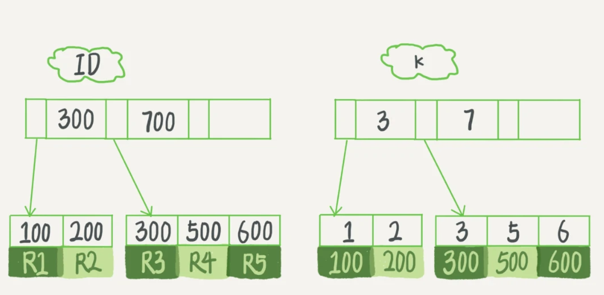

## 索引的问题

一句话简单来说，索引的出现其实就是为了提高数据查询的效率，就像书的目录一样。对于数据库，索引就是他的目录。

### 索引的常见模型

索引的出现是为了提高查询效率，但是实现索引的方式却有很多种，常见的有哈希表、有序数组和搜索树

但是里面的key并不是值递增的，查询需要遍历。

查询下，有序树组的性能就会更优。但是更新的时候在中间插入值就会导致大量的offset

数据库里多用的都是B+树，不是常见的BST，主要是为了查询少读磁盘，让访问的过程访问尽量少的数据块。

以 InnoDB 的一个整数字段索引为例，这个 N 差不多是 1200。这棵树高是 4 的时候，就可以存 1200 的 3 次方个值，这已经 17 亿了。考虑到树根的数据块总是在内存中的，一个 10 亿行的表上一个整数字段的索引，查找一个值最多只需要访问 3 次磁盘。其实，树的第二层也有很大概率在内存中，那么访问磁盘的平均次数就更少了。

### InnoDB的索引模型

在 InnoDB 中，表都是根据主键顺序以索引的形式存放的，这种存储方式的表称为索引组织表。又因为前面我们提到的，InnoDB 使用了 B+ 树索引模型，所以数据都是存储在 B+ 树中的。每一个索引在 InnoDB 里面对应一棵 B+ 树。

假设，我们有一个主键列为 ID 的表，表中有字段 k，并且在 k 上有索引。

```
create table T(
id int primary key,
k int not null, 
name varchar(16),
index (k))engine=InnoDB;
```

表中 R1~R5 的 (ID,k) 值分别为 (100,1)、(200,2)、(300,3)、(500,5) 和 (600,6)，两棵树的示例示意图如下。



根据叶子节点的内容，索引类型分为主键索引和非主键索引。主键索引的叶子节点存的是整行数据。在 InnoDB 里，主键索引也被称为聚簇索引（clustered index）。非主键索引的叶子节点内容是主键的值。在 InnoDB 里，非主键索引也被称为二级索引（secondary index）。

基于主键索引和普通索引的查询有什么区别？这里就是一个回表的问题

+ 如果语句是 select * from T where ID=500，即主键查询方式，则只需要搜索 ID 这棵 B+ 树；
+ 如果语句是 select * from T where k=5，即普通索引查询方式，则需要先搜索 k 索引树，得到 ID 的值为 500，再到 ID 索引树搜索一次。这个过程称为回表。

因此，我们在应用中应该尽量使用主键查询。一面多扫描一棵树

### 索引维护

索引的实际设计应该从业务角度出发，是否使用自增主键需要看具体的业务情景

### 覆盖索引

还是一句之前的那个例子，如果执行的语句是 select ID from T where k between 3 and 5，这时只需要查 ID 的值，而 ID 的值已经在 k 索引树上了，因此可以直接提供查询结果，不需要回表。也就是说，在这个查询里面，索引 k 已经“覆盖了”我们的查询需求，我们称为覆盖索引。

由于覆盖索引可以减少树的搜索次数，显著提升查询性能，所以使用覆盖索引是一个常用的性能优化手段。

基于上面覆盖索引的说明，我们来讨论一个问题：在一个市民信息表上，是否有必要将身份证号和名字建立联合索引？

```
CREATE TABLE `tuser` (
`id` int(11) NOT NULL, 
`id_card` varchar(32) DEFAULT NULL, 
`name` varchar(32) DEFAULT NULL, 
`age` int(11) DEFAULT NULL, 
`ismale` tinyint(1) DEFAULT NULL,
PRIMARY KEY (`id`), 
KEY `id_card` (`id_card`), 
KEY `name_age` (`name`,`age`)) ENGINE=InnoDB
```

我们知道，身份证号是市民的唯一标识。也就是说，如果有根据身份证号查询市民信息的需求，我们只要在身份证号字段上建立索引就够了。而再建立一个（身份证号、姓名）的联合索引，是不是浪费空间？

如果现在有一个高频请求，要根据市民的身份证号查询他的姓名，这个联合索引就有意义了。它可以在这个高频请求上用到覆盖索引，不再需要回表查整行记录，减少语句的执行时间。

这当然是有代价的，具体情境还是要依托业务和维护难度来考虑

### 最左前缀原则

如果我现在要按照市民的身份证号去查他的家庭地址呢，不建立新索引的话不就是全表扫描了嘛？不然

B+ 树这种索引结构，可以利用索引的“最左前缀”，来定位记录。实际情况下，索引项是有序的，你可以从满足这个条件的idcard索引开始遍历到不满足的位置，找到里面记录的主键索引。

### 索引下推

就是联合索引能看全

### 总结

数据库的一个核心问题就是索引，要从数据结构上去理解索引的设计。

我们设计表的时候，要尽量减少资源的消耗

```
alter table T drop index k;
alter table T add index(k);
```

