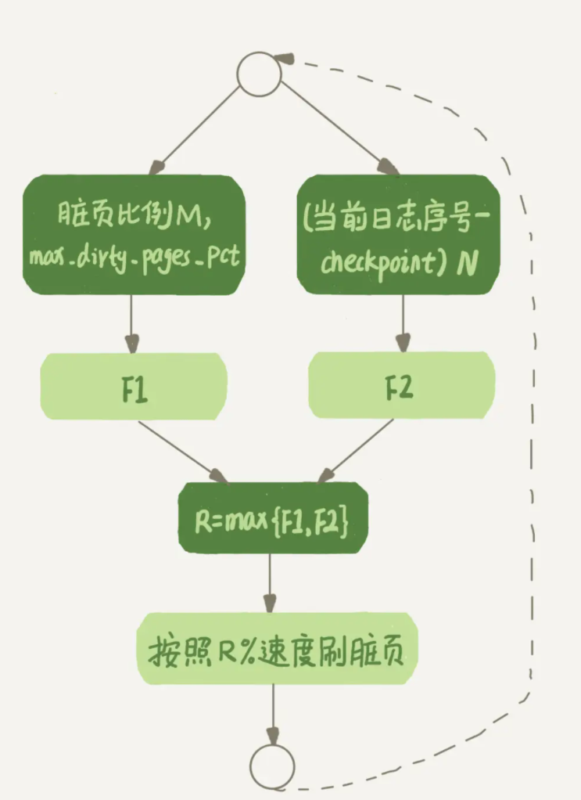

## Sql为什么变慢了

偶尔Sql突然变慢，而且这个过程难以复现。

### 为什么

思考redo log的问题，在更新磁盘的时候，要把内存写进磁盘，这是一个flush的过程。

当内存数据页跟磁盘数据页内容不一致的时候，我们称这个内存页为“脏页”。内存数据写入到磁盘后，内存和磁盘上的数据页的内容就一致了，称为“干净页”。

无论是脏页还是干净页，都是在内存中的。

而这个很难复现的变慢，可能就是在flush脏页。平时都是在写内存和日志。

1. InnoDB 的 redo log 写满了。这时候系统会停止所有更新操作，把 checkpoint 往前推进，redo log 留出空间可以继续写。
2. 系统内存不足。当需要新的内存页，而内存不够用的时候，就要淘汰一些数据页，空出内存给别的数据页使用。如果淘汰的是“脏页”，就要先将脏页写到磁盘。
3. MySQL 认为系统“空闲”的时候。
4. MySQL 正常关闭的情况。这时候，MySQL 会把内存的脏页都 flush 到磁盘上，这样下次 MySQL 启动的时候，就可以直接从磁盘上读数据，启动速度会很快。

从性能考量，后两者几乎不会怎么影响性能。前两者，

第一种是“redo log 写满了，要 flush 脏页”，这种情况是 InnoDB 要尽量避免的。因为出现这种情况的时候，整个系统就不能再接受更新了，所有的更新都必须堵住。如果你从监控上看，这时候更新数会跌为 0。

第二种是“内存不够用了，要先将脏页写到磁盘”，这种情况其实是常态。InnoDB 用缓冲池（buffer pool）管理内存，缓冲池中的内存页有三种状态：

1. 还没有使用的；
2. 使用了并且是干净页；
3. 使用了并且是脏页。

InnoDB 的策略是尽量使用内存，因此对于一个长时间运行的库来说，未被使用的页面很少。

而当要读入的数据页没有在内存的时候，就必须到缓冲池中申请一个数据页。这时候只能把最久不使用的数据页从内存中淘汰掉：如果要淘汰的是一个干净页，就直接释放出来复用；但如果是脏页呢，就必须将脏页先刷到磁盘，变成干净页后才能复用。

虽然刷脏页是常态，但是，出现下面的情况还是会影响性能的：

1. 一个查询要淘汰很多脏页的时候，响应的时间会明显变长
2. 日志写满了，性能几乎为0

所以，InnoDB需要有控制脏页比例的机制，来尽量避免这个情况。

### InnoDB控制flush脏页的机制

首先，你要正确地告诉 InnoDB 所在主机的 IO 能力，这样 InnoDB 才能知道需要全力刷脏页的时候，可以刷多快。

这就要用到 innodb_io_capacity 这个参数了，它会告诉 InnoDB 你的磁盘能力。这个值我建议你设置成磁盘的 IOPS。磁盘的 IOPS 可以通过 fio 这个工具来测试，下面的语句是我用来测试磁盘随机读写的命令：

```

fio -filename=$filename -direct=1 -iodepth 1 -thread -rw=randrw -ioengine=psync -bs=16k -size=500M -numjobs=10 -runtime=10 -group_reporting -name=mytest 
```

其实，因为没能正确地设置 innodb_io_capacity 参数，而导致的性能问题也比比皆是

我们应该定义刷脏页的能力为竭尽磁盘的权利，但是却不应该时时刻刻都在刷

如何控制速度？

刷的慢了，脏页会变多，redo log可能写满了。所以主要考虑的就是脏页的比例和写redo log的速度

InnoDB 会根据这两个因素先单独算出两个数字。

参数 innodb_max_dirty_pages_pct 是脏页比例上限，默认值是 75%。InnoDB 会根据当前的脏页比例（假设为 M），算出一个范围在 0 到 100 之间的数字，计算这个数字的伪代码类似这样：

```
F1(M){ 
	if M>=innodb_max_dirty_pages_pct then 
		return 100; 
	return 100*M/innodb_max_dirty_pages_pct;
}
```

InnoDB 每次写入的日志都有一个序号，当前写入的序号跟 checkpoint 对应的序号之间的差值，我们假设为 N。InnoDB 会根据这个 N 算出一个范围在 0 到 100 之间的数字，这个计算公式可以记为 F2(N)。F2(N) 算法比较复杂，你只要知道 N 越大，算出来的值越大就好了。

然后，根据上述算得的 F1(M) 和 F2(N) 两个值，取其中较大的值记为 R，之后引擎就可以按照 innodb_io_capacity 定义的能力乘以 R% 来控制刷脏页的速度。



InnoDB 会在后台刷脏页，而刷脏页的过程是要将内存页写入磁盘。所以，无论是你的查询语句在需要内存的时候可能要求淘汰一个脏页，还是由于刷脏页的逻辑会占用 IO 资源并可能影响到了你的更新语句,都会导致莫名其妙的性能下降

其中，脏页比例是通过 Innodb_buffer_pool_pages_dirty/Innodb_buffer_pool_pages_total 得到的，具体的命令参考下面的代码：

```

select VARIABLE_VALUE into @a from global_status where VARIABLE_NAME = 'Innodb_buffer_pool_pages_dirty';
select VARIABLE_VALUE into @b from global_status where VARIABLE_NAME = 'Innodb_buffer_pool_pages_total';
select @a/@b;
```

而还存在一个有趣的策略，就是身边有脏页的话，就顺便刷了。

一旦一个查询请求需要在执行过程中先 flush 掉一个脏页时，这个查询就可能要比平时慢了。而 MySQL 中的一个机制，可能让你的查询会更慢：在准备刷一个脏页的时候，如果这个数据页旁边的数据页刚好是脏页，就会把这个“邻居”也带着一起刷掉；而且这个把“邻居”拖下水的逻辑还可以继续蔓延，也就是对于每个邻居数据页，如果跟它相邻的数据页也还是脏页的话，也会被放到一起刷。

在 InnoDB 中，innodb_flush_neighbors 参数就是用来控制这个行为的，值为 1 的时候会有上述的“连坐”机制，值为 0 时表示不找邻居，自己刷自己的。

找“邻居”这个优化在机械硬盘时代是很有意义的，可以减少很多随机 IO。机械硬盘的随机 IOPS 一般只有几百，相同的逻辑操作减少随机 IO 就意味着系统性能的大幅度提升

而如果使用的是 SSD 这类 IOPS 比较高的设备的话，我就建议你把 innodb_flush_neighbors 的值设置成 0。因为这时候 IOPS 往往不是瓶颈，而“只刷自己”，就能更快地执行完必要的刷脏页操作，减少 SQL 语句响应时间。在 MySQL 8.0 中，innodb_flush_neighbors 参数的默认值已经是 0 了。

### 总结

flush的操作会影响mysql的实际性能，利用 WAL 技术，数据库将随机写转换成了顺序写，大大提升了数据库的性能。但也带来了脏页的问题。

脏页会被后台线程自动 flush，也会由于数据页淘汰而触发 flush，而刷脏页的过程由于会占用资源，可能会让你的更新和查询语句的响应时间长一些。

