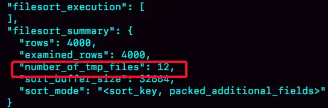
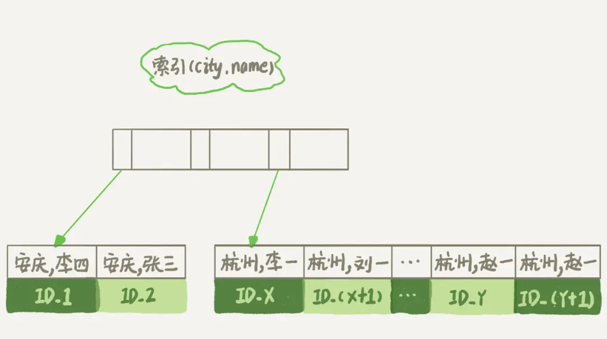

## Order by的工作原理

根据指定字段排序的问题还是挺常见的

下面的表定义，找到杭州所有人姓名，返回姓名排序前1000个人

```
CREATE TABLE `t` (
  `id` int(11) NOT NULL,
  `city` varchar(16) NOT NULL,
  `name` varchar(16) NOT NULL,
  `age` int(11) NOT NULL,
  `addr` varchar(128) DEFAULT NULL,
  PRIMARY KEY (`id`),
  KEY `city` (`city`)
) ENGINE=InnoDB;
```

SQL就可以这么写

```
select city,name,age from t where city='杭州' order by name limit 1000  ;
```

### 全字段排序

为了比秒全表扫描，势必要在city加上索引，之后explain这条语句

Extra 这个字段中的“Using filesort”表示的就是需要排序，MySQL 会给每个线程分配一块内存用于排序，称为 sort_buffer。

正常的时候语句流程如下：

1. 初始化 sort_buffer，确定放入 name、city、age 这三个字段
2. 从索引 city 找到第一个满足 city='杭州’条件的主键 id
3. 到主键 id 索引取出整行，取 name、city、age 三个字段的值，存入 sort_buffer 中；
4. 从索引 city 取下一个记录的主键 id；
5. 重复步骤 3、4 直到 city 的值不满足查询条件为止
6. 对 sort_buffer 中的数据按照字段 name 做快速排序；
7. 按照排序结果取前 1000 行返回给客户端。

即先取到了所有的数据段，之后在buffer中对他进行特定字段的排序，然后返回结果集。这个排序可能在内存中完成，也可能需要使用外部排序，这取决于排序所需的内存和参数 sort_buffer_size。

sort_buffer_size，就是 MySQL 为排序开辟的内存（sort_buffer）的大小。如果要排序的数据量小于 sort_buffer_size，排序就在内存中完成。但如果排序数据量太大，内存放不下，则不得不利用磁盘临时文件辅助排序。

确定是否需要用临时文件

```
/* 打开optimizer_trace，只对本线程有效 */
SET optimizer_trace='enabled=on'; 

/* @a保存Innodb_rows_read的初始值 */
select VARIABLE_VALUE into @a from  performance_schema.session_status where variable_name = 'Innodb_rows_read';

/* 执行语句 */
select city, name,age from t where city='杭州' order by name limit 1000; 

/* 查看 OPTIMIZER_TRACE 输出 */
SELECT * FROM `information_schema`.`OPTIMIZER_TRACE`\G

/* @b保存Innodb_rows_read的当前值 */
select VARIABLE_VALUE into @b from performance_schema.session_status where variable_name = 'Innodb_rows_read';

/* 计算Innodb_rows_read差值 */
select @b-@a;
```

这个方法是通过查看 OPTIMIZER_TRACE 的结果来确认的， number_of_tmp_files 中看到是否使用了临时文件。



number_of_tmp_files 表示的是，排序过程中使用的临时文件数。外部排序一般使用归并排序，这个需要的文件数可以理解成：MySQL 将需要排序的数据分成 12 份，每一份单独排序后存在这些临时文件中。然后把这 12 个有序文件再合并成一个有序的大文件。

examined_rows=4000，表示参与排序的行数是 4000 行。sort_mode 里面的 packed_additional_fields 的意思是，排序过程对字符串做了“紧凑”处理。即使 name 字段的定义是 varchar(16)，在排序过程中还是要按照实际长度来分配空间的。

同时，最后一个查询语句 select @b-@a 的返回结果是 4000，表示整个执行过程只扫描了 4000 行。

为了避免对结论造成干扰，把 internal_tmp_disk_storage_engine 设置成 MyISAM。否则，select @b-@a 的结果会显示为 4001。

这是因为查询 OPTIMIZER_TRACE 这个表时，需要用到临时表，而 internal_tmp_disk_storage_engine 的默认值是 InnoDB。如果使用的是 InnoDB 引擎的话，把数据从临时表取出来的时候，会让 Innodb_rows_read 的值加 1。

### rowid排序

上述有一个问题值得思考，所以如果单行很大，sort_buffer 里面要放的字段数太多，这样内存里能够同时放下的行数很少，要分成很多个临时文件，排序的性能会很差。

这个时候可以修改max_length_for_sort_data，MySQL 中专门控制用于排序的行数据的长度的一个参数。它的意思是，如果单行的长度超过这个值，MySQL 就认为单行太大，要换一个算法。

```
SET max_length_for_sort_data = 16;
```

再次执行之前的步骤，流程就会变成如下。

1. 初始化 sort_buffer，确定放入两个字段，即 name 和 id；
2. 从索引 city 找到第一个满足 city='杭州’条件的主键 id
3. 到主键 id 索引取出整行，取 name、id 这两个字段，存入 sort_buffer 中；
4. 从索引 city 取下一个记录的主键 id；
5. 重复步骤 3、4 直到不满足 city='杭州’条件为止
6. sort_buffer 中的数据按照字段 name 进行排序；
7. 遍历排序结果，取前 1000 行，并按照 id 的值回到原表中取出 city、name 和 age 三个字段返回给客户端。

总结一下就是从city索引回表，name + id,然后按照name排序，最后按照id再回表，拿到结果集

再看explain发现的变化：

1. select @b-@a 这个语句的值变成 5000 了，在排序完成后，还要根据 id 去原表取值。由于语句是 limit 1000，因此会多读 1000 行。
2. sort_mode 变成了 ，表示参与排序的只有 name 和 id 这两个字段。
3. number_of_tmp_files 变成 10 了，是因为这时候参与排序的行数虽然仍然是 4000 行，但是每一行都变小了，因此需要排序的总数据量就变小了，需要的临时文件也相应地变少了。

### 全字段排序 VS rowid排序

如果内存够，就要多利用内存，尽量减少磁盘访问。

对于 InnoDB 表来说，rowid 排序会要求回表多造成磁盘读，因此不会被优先选择。

并不是所有的 order by 语句，都需要排序操作的，MySQL 之所以需要生成临时表，并且在临时表上做排序操作，其原因是原来的数据都是无序的。

如果能够保证从 city 这个索引上取出来的行，天然就是按照 name 递增排序的话，就不用再做排序了。

可以在这个市民表上创建一个 city 和 name 的联合索引

```
alter table t add index city_user(city, name);
```



此时就不必再去排序了。这里我们还用到了age字段，设置可以创建一个city，name,age的联合索引，就可以用到覆盖索引，不去回表查age了。

```
alter table t add index city_user_age(city, name, age);
```

这样性能上会快很多。

### 总结

排序逻辑一般是用在表数据无序的时候，数据量小的时候会在内存快排，大的时候是在磁盘merge

可以按照业务需求设置联和索引，免去排序的过程，提高数据库性能