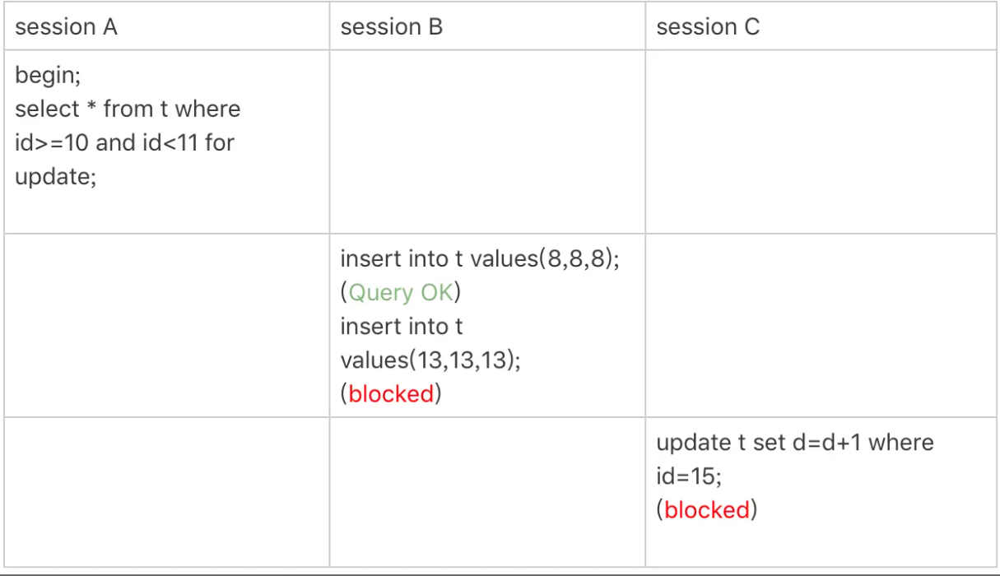
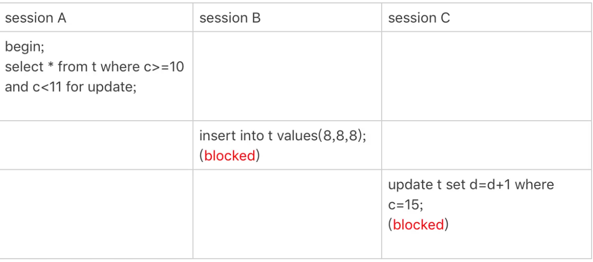
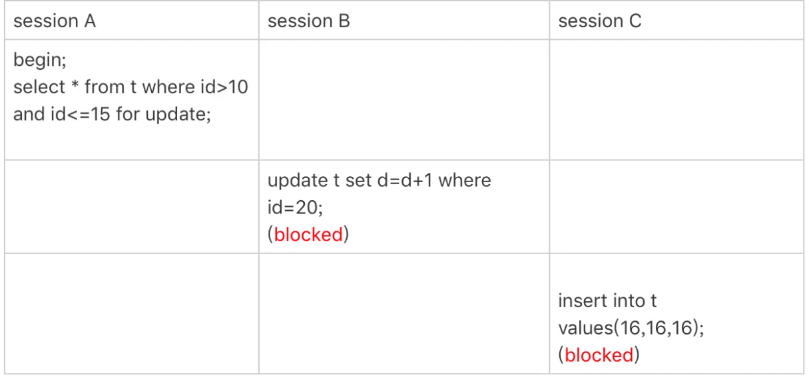
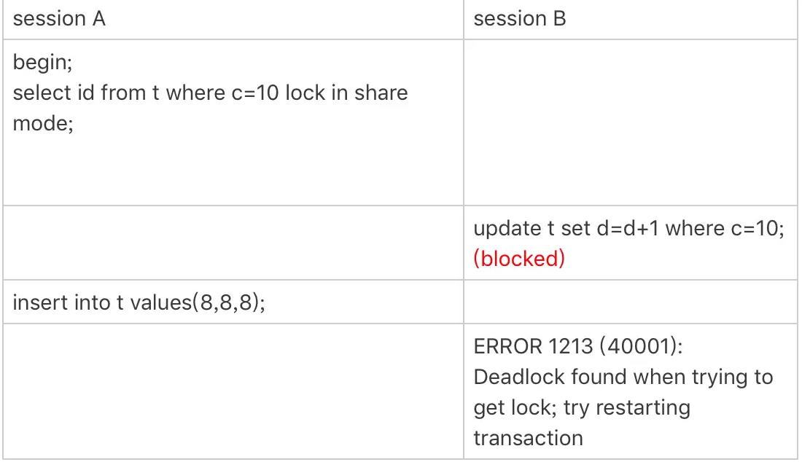

## 一行语句的锁

Mysql后面的版本可能会改变加锁的规则，这个需要具体去看源码理解。

两个原则，两个优化，一个bug：

1. 原则1：加锁的基本单位是 next-key lock，前开后闭
2. 原则2：查找中访问到的对象才加锁
3. 优化 1：索引上的等值查询，给唯一索引加锁的时候，next-key lock 退化为行锁。
4. 优化 2：索引上的等值查询，向右遍历时且最后一个值不满足等值条件的时候，next-key lock 退化为间隙锁。
5. 一个 bug：唯一索引上的范围查询会访问到不满足条件的第一个值为止。

### 案例1

表定义和初始化如下

```
CREATE TABLE `t` (
  `id` int(11) NOT NULL,
  `c` int(11) DEFAULT NULL,
  `d` int(11) DEFAULT NULL,
  PRIMARY KEY (`id`),
  KEY `c` (`c`)
) ENGINE=InnoDB;

insert into t values(0,0,0),(5,5,5),
(10,10,10),(15,15,15),(20,20,20),(25,25,25);
```

等值查询间隙锁，三分session，第一个在id = 7的行插数据，第二个在id=8的地方修改数据，第三个在id=10的地方修改id。

根据原则1，找到一个开闭区间(5，10],然后根据优化2，找不到id=7，退化为间隙锁，(5,10)。所以，第二个session不能执行，第三个可以

### 案例2

关于覆盖索引上锁，在普通索引上，找到第一个满足条件的不会立刻停下来，会继续next-key。之后优化2，退化。

锁是加在索引上的

### 案例3

主键索引的范围锁

```
select * from t where id=10 for update;
select * from t where id>=10 and id<11 for update;
```

这两句并不完全等价，查询的规则不一样



1. 开始执行的时候，要找到第一个 id=10 的行，因此本该是 next-key lock(5,10]。 根据优化 1， 主键 id 上的等值条件，退化成行锁，只加了 id=10 这一行的行锁。
2. 范围查找就往后继续找，找到 id=15 这一行停下来，因此需要加 next-key lock(10,15]。

### 案例4

非唯一索引范围锁



session A 用字段 c 来判断，在第一次用 c=10 定位记录的时候，索引 c 上加了 (5,10]这个 next-key lock 后，由于索引 c 是非唯一索引，没有优化规则，也就是说不会蜕变为行锁，因此最终 sesion A 加的锁是，索引 c 上的 (5,10] 和 (10,15] 这两个 next-key lock。

### 案例5

唯一索引范围锁bug



唯一索引理论上讲不会扫描到更大的部分，但是实现上却这么做了。

### 案例6

```
insert into t values(30,10,30);
```

此时索引c上有两个相同的值，此时执行delete c=10的时候，感觉next-key lock和优化2，锁住的范围锁是[10,15)

反而c=5的地方没有上锁

### 案例7

limit加锁，和前面一个案例不同的是加了limit = 2，此时删除的时候，遍历到c= 10的时候就不会往下走了。

所以，加锁范围就变了，(5,10]

所以在删除的时候尽量加limit，这样控制的临界区能够尽量的准确

### 案例8

死锁的一个例子



1. session A 启动事务后执行查询语句加 lock in share mode，在索引 c 上加了 next-key lock(5,10] 和间隙锁 (10,15)；
2. session B 的 update 语句也要在索引 c 上加 next-key lock(5,10] ，进入锁等待；
3. 然后 session A 要再插入 (8,8,8) 这一行，被 session B 的间隙锁锁住。由于出现了死锁，InnoDB 让 session B 回滚。

索引，b的加锁步骤分成两步，先是加 (5,10) 的间隙锁，加锁成功；然后加 c=10 的行锁，这时候才被锁住的。

### 总结

next-key lock 实际上是由间隙锁加行锁实现的

