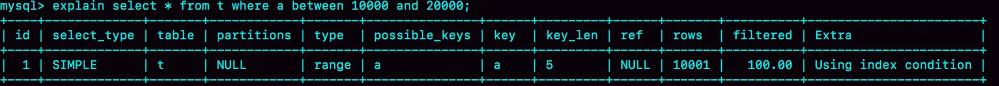
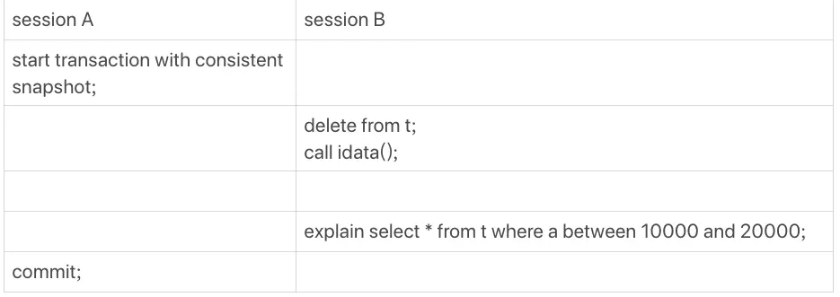
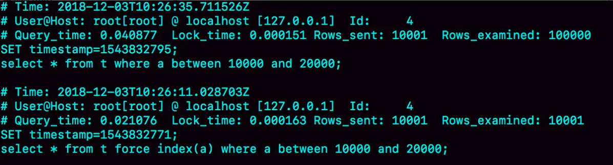
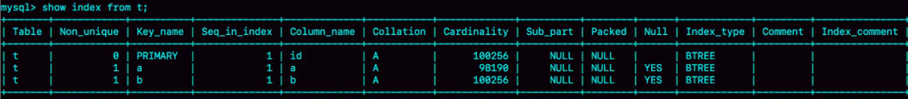
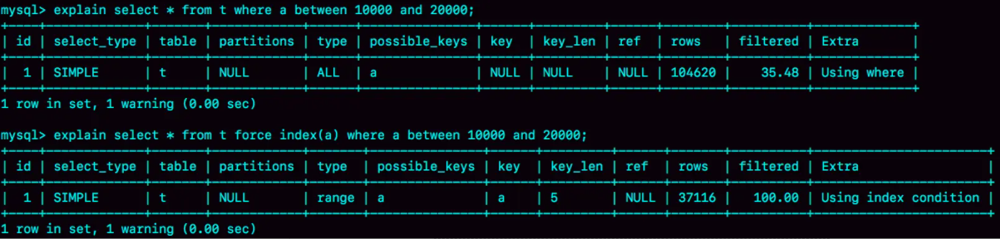
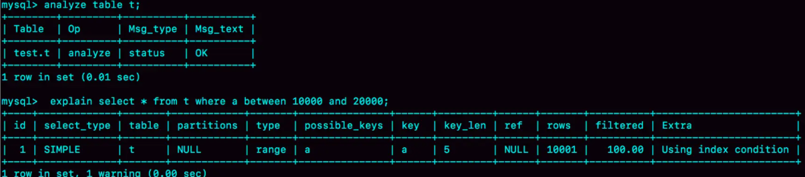
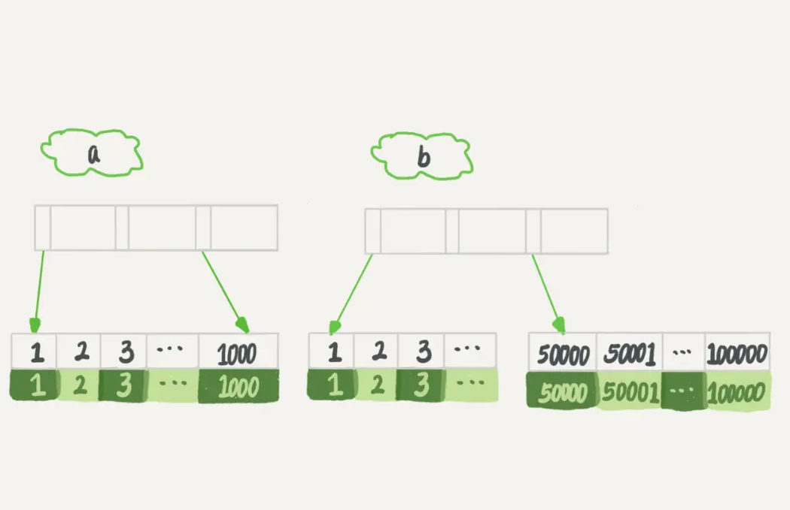
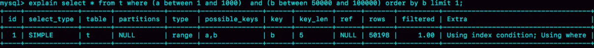
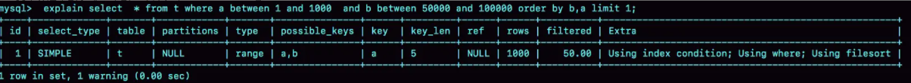

## 索引选择顺序和选错索引

MySQL 中一张表其实是可以支持多个索引的。但是，你写 SQL 语句的时候，并没有主动指定使用哪个索引。也就是说，使用哪个索引是由 MySQL 来确定的。

也就是说，一个本来执行很快的语句可能因为索引选择错误而执行的很慢

例如

```
CREATE TABLE `t` ( 
`id` int(11) NOT NULL, 
`a` int(11) DEFAULT NULL, 
`b` int(11) DEFAULT NULL, 
PRIMARY KEY (`id`), 
KEY `a` (`a`),
KEY `b` (`b`)) ENGINE=InnoDB；
```

然后，我们往表 t 中插入 10 万行记录，取值按整数递增，即：(1,1,1)，(2,2,2)，(3,3,3) 直到 (100000,100000,100000)。

```
delimiter ;;
create procedure idata()
begin 
	declare i int; 
	set i=1; 
	while(i<=100000)do 
		insert into t values(i, i, i); 
		set i=i+1; 
	end while;
end;;
delimiter ;
call idata();
```

然后分析一条语句

```
select * from t where a between 10000 and 20000;
```

a 上有索引，肯定是要使用索引 a 的,这是下意识的第一反应。

```
explain select * from t where a between 10000 and 20000;
```

看到具体字段,key这个字段是'a'，确实使用了索引a



那么我们看下一个操作



session A，开启以一个事务，之后session B 把数据都删除=，又调用了 idata 这个存储过程，插入了 10 万行数据。

这时候，session B 的查询语句 select * from t where a between 10000 and 20000 就不会再选择索引 a 了。我们可以通过慢查询日志（slow log）来查看一下具体的执行情况。

为了说明优化器选择的结果是否正确，我增加了一个对照，即：使用 force index(a) 来让优化器强制使用索引 a

```
set long_query_time=0;
select * from t where a between 10000 and 20000; /*Q1*/
select * from t force index(a) where a between 10000 and 20000;/*Q2*/
```

+ 第一句，是将慢查询日志的阈值设置为 0，表示这个线程接下来的语句都会被记录入慢查询日志中；
+ 第二句，Q1 是 session B 原来的查询；
+ 第三句，Q2 是加了 force index(a) 来和 session B 原来的查询语句执行情况对比。



可以看到，Q1 扫描了 10 万行，显然是走了全表扫描，执行时间是 40 毫秒。Q2 扫描了 10001 行，执行了 21 毫秒。也就是说，我们在没有使用 force index 的时候，MySQL 用错了索引，导致了更长的执行时间。

为什么在不断删除历史数据和新增数据的时候，mysql会选错索引呢？

### 优化器的逻辑

选择索引是优化器的工作，而优化器选择索引的目的，是找到一个最优的执行方案，并用最小的代价去执行语句。在数据库里面，扫描行数是影响执行代价的因素之一。扫描的行数越少，意味着访问磁盘数据的次数越少，消耗的 CPU 资源越少。

当然，扫描行数并不是唯一的判断标准，优化器还会结合是否使用临时表、是否排序等因素进行综合判断。

我们这个简单的查询语句并没有涉及到临时表和排序，所以 MySQL 选错索引肯定是在判断扫描行数的时候出问题了。

那么，问题就是：扫描行数是怎么判断的?

MySQL 在真正开始执行语句之前，并不能精确地知道满足这个条件的记录有多少条，而只能根据统计信息来估算记录数。

这个统计信息就是索引的“区分度”。显然，一个索引上不同的值越多，这个索引的区分度就越好。而一个索引上不同的值的个数，我们称之为“基数”（cardinality）。也就是说，这个基数越大，索引的区分度越好。

我们可以使用 show index 方法，看到一个索引的基数。如图 4 所示，就是表 t 的 show index 的结果 。虽然这个表的每一行的三个字段值都是一样的，但是在统计信息中，这三个索引的基数值并不同，而且其实都不准确。



那么，MySQL 是怎样得到索引的基数的呢?采样统计

为什么要采样统计呢？因为把整张表取出来一行行统计，虽然可以得到精确的结果，但是代价太高了，所以只能选择“采样统计”。

采样统计的时候，InnoDB 默认会选择 N 个数据页，统计这些页面上的不同值，得到一个平均值，然后乘以这个索引的页面数，就得到了这个索引的基数。

而数据表是会持续更新的，索引统计信息也不会固定不变。所以，当变更的数据行数超过 1/M 的时候，会自动触发重新做一次索引统计。

在 MySQL 中，有两种存储索引统计的方式，可以通过设置参数 innodb_stats_persistent 的值来选择：

1. 设置为 on 的时候，表示统计信息会持久化存储。这时，默认的 N 是 20，M 是 10。
2. 设置为 off 的时候，表示统计信息只存储在内存中。这时，默认的 N 是 8，M 是 16。

由于是采样统计，所以不管 N 是 20 还是 8，这个基数都是很容易不准的。

但，这还不是全部。从之前的图中看到，索然统计不精确，但是还是大体差不多的。所以还有别的原因

其实索引统计只是一个输入，对于一个具体的语句来说，优化器还要判断，执行这个语句本身要扫描多少行。

接下来，我们再一起看看优化器预估的，这两个语句的扫描行数是多少。



rows 这个字段表示的是预计扫描行数。

其中，Q1 的结果还是符合预期的，rows 的值是 104620；但是 Q2 的 rows 值是 37116，偏差就大了。

而最开始的图中我们用 explain 命令看到的 rows 是只有 10001 行，是这个偏差误导了优化器的判断。

**优化器为什么放着扫描 37000 行的执行计划不用，却选择了扫描行数是 100000 的执行计划呢？**

回表啊，如果使用索引 a，每次从索引 a 上拿到一个值，都要回到主键索引上查出整行数据，这个代价优化器也要算进去的。而如果选择扫描 10 万行，是直接在主键索引上扫描的，没有额外的代价。

优化器会估算这两个选择的代价，从结果看来，优化器认为直接扫描主键索引更快。当然，从执行时间看来，这个选择并不是最优的。

使用普通索引需要把回表的代价算进去，在图 1 执行 explain 的时候，也考虑了这个策略的代价 ，但图 1 的选择是对的。也就是说，这个策略并没有问题。

所以冤有头债有主，MySQL 选错索引，这件事儿还得归咎到没能准确地判断出扫描行数。

既然是统计信息不对，那就修正。analyze table t 命令，可以用来重新统计索引信息。我们来看一下执行效果。



这次是对的,所以在实践中，如果你发现 explain 的结果预估的 rows 值跟实际情况差距比较大，可以采用这个方法来处理。

其实，如果只是索引统计不准确，通过 analyze 命令可以解决很多问题，但是前面我们说了，优化器可不止是看扫描行数。

依然是基于这个表 t，我们看看另外一个语句：

```
select * from t where (a between 1 and 1000) and (b between 50000 and 100000) order by b limit 1;
```



如果使用索引 a 进行查询，那么就是扫描索引 a 的前 1000 个值，然后取到对应的 id，再到主键索引上去查出每一行，然后根据字段 b 来过滤。显然这样需要扫描 1000 行。如果使用索引 b 进行查询，那么就是扫描索引 b 的最后 50001 个值，与上面的执行过程相同，也是需要回到主键索引上取值再判断，所以需要扫描 50001 行。

第一感觉是a更快的。实际场景下：

```
explain select * from t where (a between 1 and 1000) and (b between 50000 and 100000) order by b limit 1;
```



返回结果中 key 字段显示，这次优化器选择了索引 b，而 rows 字段显示需要扫描的行数是 50198。

由此：

1. 扫描行数的估计值依然不准确；
2. 这个例子里 MySQL 又选错了索引。

### 索引选择异常和处理

碰上以上的情况怎么办？

1. 采用 force index 强行选择一个索引。MySQL 会根据词法解析的结果分析出可能可以使用的索引作为候选项，然后在候选列表中依次判断每个索引需要扫描多少行。如果 force index 指定的索引在候选索引列表中，就直接选择这个索引，不再评估其他索引的执行代价。
2. 第二种方法就是，我们可以考虑修改语句，引导 MySQL 使用我们期望的索引。
3. 在有些场景下，我们可以新建一个更合适的索引，来提供给优化器做选择，或删掉误用的索引。

但是方法一总归还是不优雅，而且索引改名字之后改回出现问题。上线之后再去修改，过程不够敏捷。所以，最好的方法还是在数据库内部去解决。

比如，在之前的最后一个例子中，显然把“order by b limit 1” 改成 “order by b,a limit 1” ，语义的逻辑是相同的。



之前优化器选择使用索引 b，是因为它认为使用索引 b 可以避免排序（b 本身是索引，已经是有序的了，如果选择索引 b 的话，不需要再做排序，只需要遍历），所以即使扫描行数多，也判定为代价更小。

现在 order by b,a 这种写法，要求按照 b,a 排序，就意味着使用这两个索引都需要排序。因此，扫描行数成了影响决策的主要条件，于是此时优化器选了只需要扫描 1000 行的索引 a。

最后一种方法，，在这个例子中，我没有找到通过新增索引来改变优化器行为的方法。这种情况其实比较少，尤其是经过 DBA 索引优化过的库，再碰到这个 bug，找到一个更合适的索引一般比较难。

其实这里还可以删除索引b，查询条件用这几个字段根本没过滤掉几个数据。

### 总结

对于由于索引统计信息不准确导致的问题，你可以用 analyze table 来解决。

而对于其他优化器误判的情况，你可以在应用端用 force index 来强行指定索引，也可以通过修改语句来引导优化器，还可以通过增加或者删除索引来绕过这个问题。

