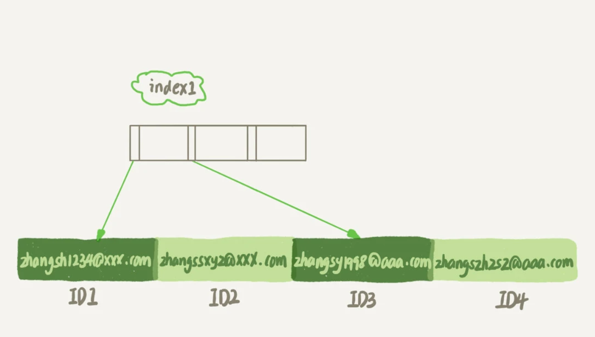
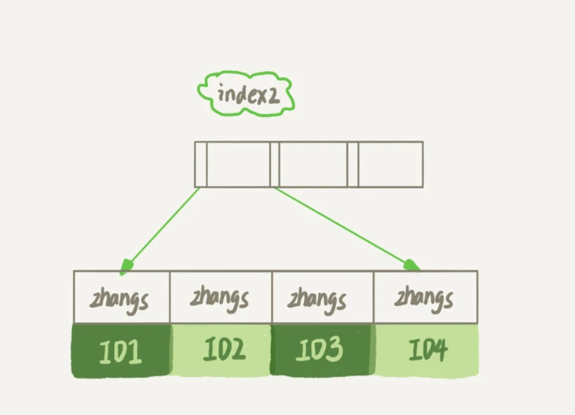

## 给字符串加索引

如何给按邮箱作为用户名的系统在这个字段上建立合适的索引？

```
create table SUser(
ID bigint unsigned primary key,
email varchar(64), 
... )engine=innodb;
```

因为要使用邮箱作为登录用户名

```
select f1, f2 from SUser where email='xxx';
```

这样的语句一定会出出现。如果email这个字段上没有索引的话，那么一定会经历一个全表扫描。

同时，mysql是支持前缀索引的，你可以定义一部分的字符串作为索引，默认地，如果你创建索引的语句不指定前缀长度，那么索引就会包含整个字符串。

比如，这两个在 email 字段上创建索引的语句：

```
alter table SUser add index index1(email);
或
alter table SUser add index index2(email(6));
```

第一个语句创建的 index1 索引里面，包含了每个记录的整个字符串；而第二个语句创建的 index2 索引里面，对于每个记录都是只取前 6 个字节。

这二者的区别如下：





由于 email(6) 这个索引结构中每个邮箱字段都只取前 6 个字节（即：zhangs），所以占用的空间会更小，这就是使用前缀索引的优势。

但，这同时带来的损失是，可能会增加额外的记录扫描次数。

如何执行？

```
select id,name,email from SUser where email='zhangssxyz@xxx.com';
```

如果使用的是 index1（即 email 整个字符串的索引结构），执行顺序是这样的：

1. 从 index1 索引树找到满足索引值是’zhangssxyz@xxx.com’的这条记录，取得 ID2 的值；
2. 到主键上查到主键值是 ID2 的行，判断 email 的值是正确的，将这行记录加入结果集；
3. 取 index1 索引树上刚刚查到的位置的下一条记录，发现已经不满足 email='zhangssxyz@xxx.com’的条件了，循环结束。

这种下，只需要回表一次，所以系统认为只扫描了一行

使用index2

1. 从 index2 索引树找到满足索引值是’zhangs’的记录，找到的第一个是 ID1；
2. 到主键上查到主键值是 ID1 的行，判断出 email 的值不是’zhangssxyz@xxx.com’，这行记录丢弃；
3. 取 index2 上刚刚查到的位置的下一条记录，发现仍然是’zhangs’，取出 ID2，再到 ID 索引上取整行然后判断，这次值对了，将这行记录加入结果集；
4. 重复上一步，直到在 idxe2 上取到的值不是’zhangs’时，循环结束。

在这个过程中，要回主键索引取 4 次数据，也就是扫描了 4 行。

使用前缀索引后，可能会导致查询语句读数据的次数变多。

但是，对于这个查询语句来说，如果你定义的 index2 不是 email(6) 而是 email(7），也就是说取 email 字段的前 7 个字节来构建索引的话，即满足前缀’zhangss’的记录只有一个，也能够直接查到 ID2，只扫描一行就结束了。

也就是说使用前缀索引，定义好长度，就可以做到既节省空间，又不用额外增加太多的查询成本。

**那么如何确定这个合理的长度呢？**

我们在建立索引时关注的是区分度，区分度越高越好。因为区分度越高，意味着重复的键值越少。因此，我们可以通过统计索引上有多少个不同的值来判断要使用多长的前缀。

下面的语句可以用来统计这个列上有多少个不同的值

```
select count(distinct email) as L from SUser;
```

然后，依次选取不同长度的前缀来看这个值，比如我们要看一下 4~7 个字节的前缀索引，可以用这个语句：

```
select count(distinct left(email,4)）as L4, 
count(distinct left(email,5)）as L5, 
count(distinct left(email,6)）as L6, 
count(distinct left(email,7)）as L7,
from SUser;
```

当然，使用前缀索引很可能会损失区分度，所以你需要预先设定一个可以接受的损失比例，比如 5%。然后，在返回的 L4~L7 中，找出不小于 L * 95% 的值，假设这里 L6、L7 都满足，你就可以选择前缀长度为 6。

### 前缀索引对覆盖索引的影响

前缀索引可能不仅仅只影响到扫描的行数

```
select id,email from SUser where email='zhangssxyz@xxx.com';
```

和下面的相比

```
select id,name,email from SUser where email='zhangssxyz@xxx.com';
```

第一个语句只要求返回id和email的字段，所以，如果使用 index1（即 email 整个字符串的索引结构）的话，可以利用覆盖索引，从 index1 查到结果后直接就返回了，不需要回到 ID 索引再去查一次。而如果使用 index2（即 email(6) 索引结构）的话，就不得不回到 ID 索引再去判断 email 字段的值。

即使你将 index2 的定义修改为 email(18) 的前缀索引，这时候虽然 index2 已经包含了所有的信息，但 InnoDB 还是要回到 id 索引再查一下，因为系统并不确定前缀索引的定义是否截断了完整信息。

也就是说，使用前缀索引就用不上覆盖索引对查询性能的优化了，这也是你在选择是否使用前缀索引时需要考虑的一个因素。

### 其他的方式

前缀分离度不够好的时候怎么处理呢？比如，我们国家的身份证号，一共 18 位，其中前 6 位是地址码，所以同一个县的人的身份证号前 6 位一般会是相同的。如果要分离度够好，就要选择更长的前缀。

索引选取的越长，占用的磁盘空间就越大，相同的数据页能放下的索引值就越少，搜索的效率也就会越低。

如果我们能够确定业务需求里面只有按照身份证进行等值查询的需求，我们可以使用如下的两种方法：

第一种方式是使用倒序存储。如果你存储身份证号的时候把它倒过来存，每次查询的时候，你可以这么写：

```
select field_list from t where id_card = reverse('input_id_card_string');
```

第二种就是使用hash字段，在表上创建一个整数字段，来保存身份证的校验码。同时在这个字段上创建索引

```
alter table t add id_card_crc int unsigned, add index(id_card_crc);
```

然后每次插入新记录的时候，都同时用 crc32() 这个函数得到校验码填到这个新字段。由于校验码可能存在冲突，也就是说两个不同的身份证号通过 crc32() 函数得到的结果可能是相同的，所以你的查询语句 where 部分要判断 id_card 的值是否精确相同。

这样，索引的长度变成了 4 个字节，比原来小了很多。

但是这两种方法都不支持范围查询，只支持等值查询

1. 从占用的额外空间来看，倒序存储方式在主键索引上，不会消耗额外的存储空间，而 hash 字段方法需要增加一个字段。当然，倒序存储方式使用 4 个字节的前缀长度应该是不够的，如果再长一点，这个消耗跟额外这个 hash 字段也差不多抵消了。
2. 在 CPU 消耗方面，倒序方式每次写和读的时候，都需要额外调用一次 reverse 函数，而 hash 字段的方式需要额外调用一次 crc32() 函数。如果只从这两个函数的计算复杂度来看的话，reverse 函数额外消耗的 CPU 资源会更小些。
3. 从查询效率上看，使用 hash 字段方式的查询性能相对更稳定一些。因为 crc32 算出来的值虽然有冲突的概率，但是概率非常小，可以认为每次查询的平均扫描行数接近 1。而倒序存储方式毕竟还是用的前缀索引的方式，也就是说还是会增加扫描行数。

### 总结

1. 直接创建完整索引，这样可能比较占用空间；
2. 创建前缀索引，节省空间，但会增加查询扫描次数，并且不能使用覆盖索引；
3. 倒序存储，再创建前缀索引，用于绕过字符串本身前缀的区分度不够的问题；
4. 创建 hash 字段索引，查询性能稳定，有额外的存储和计算消耗，跟第三种方式一样，都不支持范围扫描。