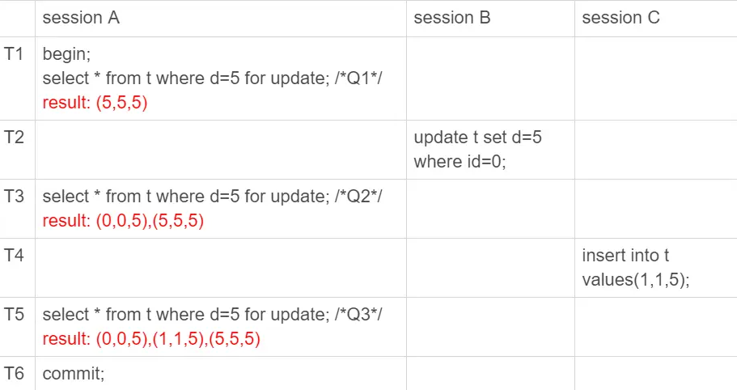

## 幻读

用到的表

```
CREATE TABLE `t` (
  `id` int(11) NOT NULL,
  `c` int(11) DEFAULT NULL,
  `d` int(11) DEFAULT NULL,
  PRIMARY KEY (`id`),
  KEY `c` (`c`)
) ENGINE=InnoDB;

insert into t values(0,0,0),(5,5,5),
(10,10,10),(15,15,15),(20,20,20),(25,25,25);
```

考虑加锁的问题

```
begin;
select * from t where d=5 for update;
commit;
```

id = 5 这一行的时候select完成之后会加一个写锁，两阶段锁协议，这个写锁会在执行 commit 语句的时候释放。

### 幻读是什么



1. Q1 只返回 id=5 这一行；
2. 在 T2 时刻，session B 把 id=0 这一行的 d 值改成了 5，因此 T3 时刻 Q2 查出来的是 id=0 和 id=5 这两行；
3. 在 T4 时刻，session C 又插入一行（1,1,5），因此 T5 时刻 Q3 查出来的是 id=0、id=1 和 id=5 的这三行。

其中，Q3 读到 id=1 这一行的现象，被称为“幻读”。也就是说，幻读指的是一个事务在前后两次查询同一个范围的时候，后一次查询看到了前一次查询没有看到的行。

说明：

1. 在可重复读隔离级别下，普通的查询是快照读，是不会看到别的事务插入的数据的。因此，幻读在“当前读”下才会出现。
2. 上面 session B 的修改结果，被 session A 之后的 select 语句用“当前读”看到，不能称为幻读。幻读仅专指“新插入的行”。

因为这三个查询都是加了 for update，都是当前读。而当前读的规则，就是要能读到所有已经提交的记录的最新值。并且，session B 和 sessionC 的两条语句，执行后就会提交，所以 Q2 和 Q3 就是应该看到这两个事务的操作效果，而且也看到了，这跟事务的可见性规则并不矛盾。

### 幻读的问题

1. 语义被破坏了，我要lock住d= 5 的行
2. 数据一致性的问题

### 解决幻读的问题

行锁只能lock行，要解决的是间隙的问题，间隙不存在，锁不住。

所以引入了间隙锁。

间隙锁一般不会相互冲突，解决了幻读的问题，但是会带来一些困扰。

### 总结

行锁确实比较直观，判断规则也相对简单，间隙锁的引入会影响系统的并发度，也增加了锁分析的复杂度

