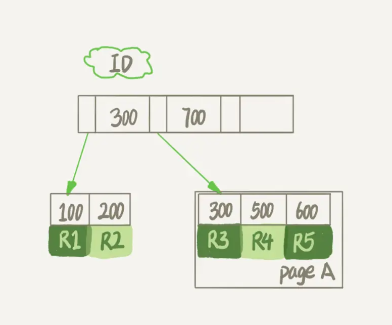

## 空间回收的相关问题

一个 InnoDB 表包含两部分，即：表结构定义和数据。在 MySQL 8.0 版本以前，表结构是存在以.frm 为后缀的文件里。而 MySQL 8.0 版本，则已经允许把表结构定义放在系统数据表中了。因为表结构定义占用的空间很小，所以主要讨论的是表数据。

简单地删除表数据达不到表空间回收的效果

### 参数innodb_file_per_table

表数据既可以存在共享表空间里，也可以是单独的文件。这个行为是由参数 innodb_file_per_table 控制的：

1. 这个参数设置为 OFF 表示的是，表的数据放在系统共享表空间，也就是跟数据字典放在一起；
2. 这个参数设置为 ON 表示的是，每个 InnoDB 表数据存储在一个以 .ibd 为后缀的文件中。

从 MySQL 5.6.6 版本开始，它的默认值就是 ON 了。不论使用 MySQL 的哪个版本，都将这个值设置为 ON。因为，一个表单独存储为一个文件更容易管理，而且在你不需要这个表的时候，通过 drop table 命令，系统就会直接删除这个文件。而如果是放在共享表空间中，即使表删掉了，空间也是不会回收的

我们在删除整个表的时候，可以使用 drop table 命令回收表空间，但是，我们遇到的更多的删除数据的场景是删除某些行，这时就遇到了问题：表中的数据被删除了，但是表空间却没有被回收。

### 数据删除流程

InnoDB的数据都是用B+树来索引的，假设，我们要删掉 R4 这个记录，InnoDB 引擎只会把 R4 这个记录标记为删除。如果之后要再插入一个 ID 在 300 和 600 之间的记录时，可能会复用这个位置。但是，磁盘文件的大小并不会缩小。



当我们删掉整个数据页的记录的时候，数据不是被擦除了，而是处于可覆盖的状态

但是，数据页的复用跟记录的复用是不同的

记录的复用，只限于符合范围条件的数据。比如上面的这个例子，R4 这条记录被删除后，如果插入一个 ID 是 400 的行，可以直接复用这个空间。但如果插入的是一个 ID 是 800 的行，就不能复用这个位置了。

而当整个页从 B+ 树里面摘掉以后，可以复用到任何位置。以图 1 为例，如果将数据页 page A 上的所有记录删除以后，page A 会被标记为可复用。这时候如果要插入一条 ID=50 的记录需要使用新页的时候，page A 是可以被复用的。

如果相邻的两个数据页利用率都很小，系统就会把这两个页上的数据合到其中一个页上，另外一个数据页就被标记为可复用。

进一步地，如果我们用 delete 命令把整个表的数据删除呢？结果就是，所有的数据页都会被标记为可复用。但是磁盘上，文件不会变小。

delete 命令其实只是把记录的位置，或者数据页标记为了“可复用”，但磁盘文件的大小是不会变的。也就是说，通过 delete 命令是不能回收表空间的。这些可以复用，而没有被使用的空间，看起来就像是“空洞”。

实际上，不止是删除数据会造成空洞，插入数据也会。

如果数据是按照索引递增顺序插入的，那么索引是紧凑的。但如果数据是随机插入的，就可能造成索引的数据页分裂。

更新索引上的值，可以理解为删除一个旧的值，再插入一个新值

经过大量增删改的表，都是可能是存在空洞的。所以，如果能够把这些空洞去掉，就能达到收缩表空间的目的。

### 重建表

如何去掉空洞？

你可以新建一个与表 A 结构相同的表 B，然后按照主键 ID 递增的顺序，把数据一行一行地从表 A 里读出来再插入到表 B 中。

由于表 B 是新建的表，所以表 A 主键索引上的空洞，在表 B 中就都不存在了。显然地，表 B 的主键索引更紧凑，数据页的利用率也更高。如果我们把表 B 作为临时表，数据从表 A 导入表 B 的操作完成后，用表 B 替换 A，从效果上看，就起到了收缩表 A 空间的作用。

这里，你可以使用 alter table A engine=InnoDB 命令来重建表。在 MySQL 5.5 版本之前，这个命令的执行流程跟我们前面描述的差不多，区别只是这个临时表 B 不需要你自己创建，MySQL 会自动完成转存数据、交换表名、删除旧表的操作。


显然，花时间最多的步骤是往临时表插入数据的过程，如果在这个过程中，有新的数据要写入到表 A 的话，就会造成数据丢失。因此，在整个 DDL 过程中，表 A 中不能有更新。也就是说，这个 DDL 不是 Online 的。

而在 MySQL 5.6 版本开始引入的 Online DDL，对这个操作流程做了优化：

1. 建立一个临时文件，扫描表 A 主键的所有数据页；
2. 用数据页中表 A 的记录生成 B+ 树，存储到临时文件中；
3. 生成临时文件的过程中，将所有对 A 的操作记录在一个日志文件（row log）中，对应的是图中 state2 的状态；
4. 临时文件生成后，将日志文件中的操作应用到临时文件，得到一个逻辑数据上与表 A 相同的数据文件，对应的就是图中 state3 的状态；
5. 用临时文件替换表 A 的数据文件。


由于日志文件记录和重放操作这个功能的存在，这个方案在重建表的过程中，允许对表 A 做增删改操作。这也就是 Online DDL 名字的来源。

### online和inplace

在上图中，我们把表 A 中的数据导出来的存放位置叫作 tmp_table。这是一个临时表，是在 server 层创建的。

根据表 A 重建出来的数据是放在“tmp_file”里的，这个临时文件是 InnoDB 在内部创建出来的。整个 DDL 过程都在 InnoDB 内部完成。对于 server 层来说，没有把数据挪动到临时表，是一个“原地”操作，这就是“inplace”名称的来源。

所以，我现在问你，如果你有一个 1TB 的表，现在磁盘间是 1.2TB，能不能做一个 inplace 的 DDL 呢？答案是不能。因为，tmp_file 也是要占用临时空间的。

我们重建表的这个语句 alter table t engine=InnoDB，其实隐含的意思是：

```
alter table t engine=innodb,ALGORITHM=inplace;
```

跟 inplace 对应的就是拷贝表的方式了，用法是：

```
alter table t engine=innodb,ALGORITHM=copy;
```

当你使用 ALGORITHM=copy 的时候，表示的是强制拷贝表，对应的流程就是图2的方式了。

但我这样说你可能会觉得，inplace 跟 Online 是不是就是一个意思？

其实不是的，只是在重建表这个逻辑中刚好是这样而已。

比如，如果我要给 InnoDB 表的一个字段加全文索引，写法是：

```
alter table t add FULLTEXT(field_name);
```

这个过程是 inplace 的，但会阻塞增删改操作，是非 Online 的。

如果说这两个逻辑之间的关系是什么的话，可以概括为：

1. DDL 过程如果是 Online 的，就一定是 inplace 的；
2. 反过来未必，也就是说 inplace 的 DDL，有可能不是 Online 的。截止到 MySQL 8.0，添加全文索引（FULLTEXT index）和空间索引 (SPATIAL index) 就属于这种情况。

### 总结

如果要收缩一个表，只是 delete 掉表里面不用的数据的话，表文件的大小是不会变的，你还要通过 alter table 命令重建表，才能达到表文件变小的目的。

重建表的两种实现方式，Online DDL 的方式是可以考虑在业务低峰期使用的，而 MySQL 5.5 及之前的版本，这个命令是会阻塞 DML 的，需要注意。