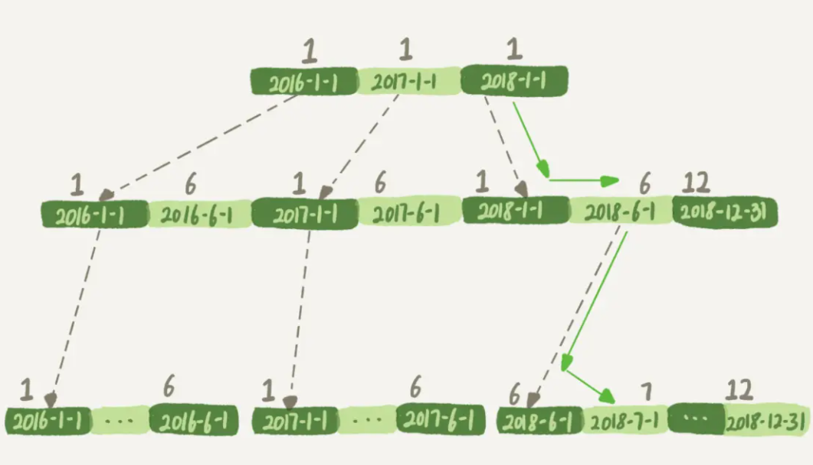
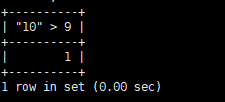

## 语句性能问题

很多SQL语句，看起来逻辑相差无几，但是实际执行起来性能天差地别，具体分析三个场景。

### 场景一，条件字段场景操作

假设维护一个交易系统，其中交易记录表 tradelog 包含交易流水号（tradeid）、交易员 id（operator）、交易时间（t_modified）等字段。

```
CREATE TABLE `tradelog` (
  `id` int(11) NOT NULL,
  `tradeid` varchar(32) DEFAULT NULL,
  `operator` int(11) DEFAULT NULL,
  `t_modified` datetime DEFAULT NULL,
  PRIMARY KEY (`id`),
  KEY `tradeid` (`tradeid`),
  KEY `t_modified` (`t_modified`)
) ENGINE=InnoDB DEFAULT CHARSET=utf8mb4;
```

假设要找到所有年份中7月的交易记录总数

```
select count(*) from tradelog where month(t_modified)=7;
```

t_modified 字段上有索引,直接使用的是却发现执行了很久才有结果。原因就是，对字段做了函数计算，就用不上索引了，这是 MySQL 的规定



如果找where t_modified='2018-7-1’，引擎就会按照上面绿色箭头的路线，快速定位到 t_modified='2018-7-1’需要的结果。这里的快速定位能力其实是用到了同一层兄弟节点的有序性。

如果计算 month() 函数的话，在树的第一层就不知道怎么办了。**对索引字段做函数操作，可能会破坏索引值的有序性，因此优化器就决定放弃走树搜索功能。**

需要注意的是，优化器并不是要放弃使用这个索引。

在这个例子里，放弃了树搜索功能，优化器可以选择遍历主键索引，也可以选择遍历索引 t_modified，优化器对比索引大小后发现，索引 t_modified 更小，遍历这个索引比遍历主键索引来得更快。因此最终还是会选择索引 t_modified。实际explain的时候发现，key还是走了modified这个索引，但是走了一遍全索引。

实际上，为了利用到索引的快速定位能力，把sql语句改成基于字段本身的范围查询，就可以利用到索引的优化了。

```
select count(*) from tradelog where
     (t_modified >= '2016-7-1' and t_modified<'2016-8-1') or
     (t_modified >= '2017-7-1' and t_modified<'2017-8-1') or 
     (t_modified >= '2018-7-1' and t_modified<'2018-8-1');
```

如果有更多的年份的话，需要把年份补齐。

### 场景2,隐式类型转换

```
select * from tradelog where tradeid=110717;
```

tradeid 这个字段上,有索引，但是explain显示要走全表扫描。tradeid 的字段类型是 varchar(32)，而输入的参数却是整型，所以需要做类型转换。

比较简单的看到转换规则的方法是

```
select “10” > 9
```



这里就能确定规则了，数字变字符串的话就是0，反之，字符串变数字的话就是1

之前的语句，对于优化器来说，要做一个转换，对索引字段做函数操作的时候，优化器回放弃走搜索树的功能。

```
select * from tradelog where  CAST(tradid AS signed int) = 110717;
```

### 场景3，隐式字符编码转换

还有一个trade_detail表，

```
CREATE TABLE `trade_detail` (
  `id` int(11) NOT NULL,
  `tradeid` varchar(32) DEFAULT NULL,
  `trade_step` int(11) DEFAULT NULL, /*操作步骤*/
  `step_info` varchar(32) DEFAULT NULL, /*步骤信息*/
  PRIMARY KEY (`id`),
  KEY `tradeid` (`tradeid`)
) ENGINE=InnoDB DEFAULT CHARSET=utf8;

insert into tradelog values(1, 'aaaaaaaa', 1000, now());
insert into tradelog values(2, 'aaaaaaab', 1000, now());
insert into tradelog values(3, 'aaaaaaac', 1000, now());

insert into trade_detail values(1, 'aaaaaaaa', 1, 'add');
insert into trade_detail values(2, 'aaaaaaaa', 2, 'update');
insert into trade_detail values(3, 'aaaaaaaa', 3, 'commit');
insert into trade_detail values(4, 'aaaaaaab', 1, 'add');
insert into trade_detail values(5, 'aaaaaaab', 2, 'update');
insert into trade_detail values(6, 'aaaaaaab', 3, 'update again');
insert into trade_detail values(7, 'aaaaaaab', 4, 'commit');
insert into trade_detail values(8, 'aaaaaaac', 1, 'add');
insert into trade_detail values(9, 'aaaaaaac', 2, 'update');
insert into trade_detail values(10, 'aaaaaaac', 3, 'update again');
insert into trade_detail values(11, 'aaaaaaac', 4, 'commit');
```

这时候，如果要查询 id=2 的交易的所有操作步骤信息，

```
select d.* from tradelog l, trade_detail d where d.tradeid=l.tradeid and l.id=2; /*语句Q1*/
```

在这个执行计划里，是从 tradelog 表中取 tradeid 字段，再去 trade_detail 表里查询匹配字段。因此，我们把 tradelog 称为驱动表，把 trade_detail 称为被驱动表，把 tradeid 称为关联字段。

explain的时候会发现在详情表上查id的时候没用到索引，但是实际上是用到了索引的。

这两个表的字符集不同，一个是 utf8，一个是 utf8mb4，所以做表连接查询的时候用不上关联字段的索引

```
select * from trade_detail where tradeid=$L2.tradeid.value;
```

`$L2.tradeid.value `的字符集是 `utf8mb4`,查详情表的步骤可以看作这个。

字符集 utf8mb4 是 utf8 的超集，所以当这两个类型的字符串在做比较的时候，MySQL 内部的操作是，先把 utf8 字符串转成 utf8mb4 字符集，再做比较。一般都是小转大，防止截断

因此， 在执行上面这个语句的时候，需要将被驱动数据表里的字段一个个地转换成 utf8mb4，再跟 L2 做比较。

```
select * from trade_detail  where CONVERT(traideid USING utf8mb4)=$L2.tradeid.value; 
```

同理，对索引字段做函数操作，放弃走树搜索功能。、

实际中，一般换编码

```
alter table trade_detail modify tradeid varchar(32) CHARACTER SET utf8mb4 default null;
```

业务大，来不及换的话,在输入参数上加函数，不要改被驱动的表的索引字段

```
select d.* from tradelog l , trade_detail d where d.tradeid=CONVERT(l.tradeid USING utf8) and l.id=2; 
```

### 总结

对索引字段做函数操作，可能会破坏索引值的有序性，因此优化器就决定放弃走树搜索功能。

实际场景需要实际分析，explain一下实际的语句是比较好的。

主要看里面的`key`，`Extra`，`rows`字段的情况。