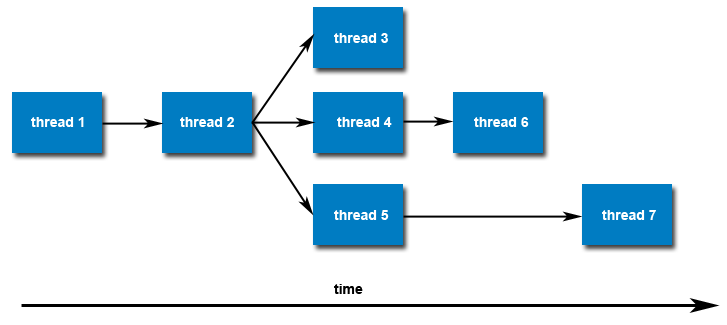

#  创建和终止线程

## 函数

+ [pthread_create](https://hpc-tutorials.llnl.gov/posix/man/pthread_create.txt)(thread,attr,start_routine,arg)
+ [pthread_exit](https://hpc-tutorials.llnl.gov/posix/man/pthread_exit.txt)(status)
+ [pthread_cancel](https://hpc-tutorials.llnl.gov/posix/man/pthread_cancel.txt)(thread)
+ [pthread_attr_init](https://hpc-tutorials.llnl.gov/posix/man/pthread_attr_init.txt)(attr)
+ [pthread_attr_destroy](https://hpc-tutorials.llnl.gov/posix/man/pthread_attr_destroy.txt)(attr)

## 创建线程

最初，你的主程序中包含着一个单独的默认线程。所有其他的线程必须显式的由程序员创建。pthread_create创建新线程并运行。这个函数可以在你的代码中的任意位置，任意时间被调用。

pthread_create参数：

+ **thread**：子例程返回的新线程的唯一隐式标识符
+ **attr**：可用于设置线程属性的隐式对象。你可以将它设置为一个属性对象或者是默认NULL
+ **start_routine**:线程要运行的函数
+ **arg**：一个会被传递给要运行的函数的参数，必须用引用或者强转成void指针传递。如果没有参数传递就设置为NULL

一个进程的最大可创建线程数取决于具体的系统实现。试图超过这个限制的程序可能会失败或者产生错误的结果。

查询和设置您的实现的线程限制-Linux示例显示。演示如何查询默认(软)限制，然后将最大进程数(包括线程)设置为硬限制。然后验证该限制是否已被解除。

```
$ ulimit -a
core file size          (blocks, -c) 16
data seg size           (kbytes, -d) unlimited
scheduling priority             (-e) 0
file size               (blocks, -f) unlimited
pending signals                 (-i) 255956
max locked memory       (kbytes, -l) 64
max memory size         (kbytes, -m) unlimited
open files                      (-n) 1024
pipe size            (512 bytes, -p) 8
POSIX message queues     (bytes, -q) 819200
real-time priority              (-r) 0
stack size              (kbytes, -s) unlimited
cpu time               (seconds, -t) unlimited
max user processes              (-u) 1024
virtual memory          (kbytes, -v) unlimited
file locks                      (-x) unlimited

$ ulimit -Hu
7168

$ ulimit -u 7168

$ ulimit -a
core file size          (blocks, -c) 16
data seg size           (kbytes, -d) unlimited
scheduling priority             (-e) 0
file size               (blocks, -f) unlimited
pending signals                 (-i) 255956
max locked memory       (kbytes, -l) 64
max memory size         (kbytes, -m) unlimited
open files                      (-n) 1024
pipe size            (512 bytes, -p) 8
POSIX message queues     (bytes, -q) 819200
real-time priority              (-r) 0
stack size              (kbytes, -s) unlimited
cpu time               (seconds, -t) unlimited
max user processes              (-u) 7168
virtual memory          (kbytes, -v) unlimited
file locks                      (-x) unlimited
```

一旦线程被创建，线程就是对等的，它可以创建其他的线程。线程之间并没有隐含的层次结构或者依赖关系。



## 线程属性

默认情况下，被创建的线程会有一些确认属性。某些属性可以通过程序员设置线程属性对象而改变

pthread_attr_init和pthread_attr_destroy被用来创建/销毁线程属性对象。

其余的函数用来查询和设置确定的属性。这些属性包括：

+ 可分离或者可汇合状态
+ 调度继承
+ 调度策略
+ 调度参数
+ 调度争用范围
+ 栈大小
+ 栈地址
+ 栈保护大小（溢出）
+ 其余的会在后续讨论

线程绑定和调度

问题：线程创建后，如何知道：a)操作系统将在何时调度它，以及b)他将在那个处理器上运行？

除非你使用pthreads调度机制，否则由实现（或操作系统）决定线程将在何处和何时运行。

健壮的程序不应该依赖以特定的顺序或者特定处理器（内核）执行线程

pthreads的API提供了几个函数，可以用于指定线程如何调度执行。例如，线程可以被调度为FIFO（先进先出），RR（Round-Robin）或其他由操作系统决定的方式。他还提供了设置线程调度优先级的能力。

这些主题不在次数涵盖，但是可以在 [sched_setscheduler](https://hpc-tutorials.llnl.gov/posix/man/sched_setscheduler.txt)中找到很好的概述。

pthread不提供将线程绑定到线程绑定到特定的cpu或者内核上的函数。但是，本地实现可能会有这些函数，比如提供的 [pthread_setaffinity_np](https://hpc-tutorials.llnl.gov/posix/man/pthread_setaffinity_np.txt)函数。注意“_np”代表不可移植。

同样，本地操作系统可能提供了类似的解决方式。比如，linux提供的[sched_setaffinity](https://hpc-tutorials.llnl.gov/posix/man/sched_setaffinity.txt) 函数。

## 结束线程 && `pthread_exit()`

有几种终止线程的方式

+ 线程从起始位置正常返回，工作结束。
+ 线程调用pthread_exit函数，无论他的工作是否完成。
+ 该线程被另一个线程通过 pthread_cancel 例程取消。
+ 由于调用 exec() 或 exit() ，整个过程终止
+ 如果 main() 首先完成，而不显式调用 pthread_exit 本身

pthread_exit()函数允许程序员指定一个可选的终止状态参数。这个可选参数通常返回终止之后汇入的线程。

正常执行完成的子程序中，你通常可以免去调用pthread_exit，除非你想将可选状态代码传回。

清理，pthread_exit()不关闭文件,线程终止之后,任何在线程内打开的文件都会保持打开状态.

从 main() 调用 pthread_exit() 的讨论：

+ 如果不显式调用 pthread_exit()，那么如果 main() 在它产生的线程之前完成，那么肯定会出现问题。它创建的所有线程都将终止，因为 main() 已完成并且不再存在以支持线程运行。
+ 通过让 main() 明确调用 pthread_exit() 作为它做的最后一件事，main() 将阻塞并保持活动状态以支持它创建的线程，直到它们完成。

## 例子:线程创建和终止

```
#include <pthread.h>
 #include <stdio.h>
 #define NUM_THREADS     5

 void *PrintHello(void *threadid)
 {
    long tid;
    tid = (long)threadid;
    printf("Hello World! It's me, thread #%ld!\n", tid);
    pthread_exit(NULL);
 }

 int main (int argc, char *argv[])
 {
    pthread_t threads[NUM_THREADS];
    int rc;
    long t;
    for(t=0; t<NUM_THREADS; t++){
       printf("In main: creating thread %ld\n", t);
       rc = pthread_create(&threads[t], NULL, PrintHello, (void *)t);
       if (rc){
          printf("ERROR; return code from pthread_create() is %d\n", rc);
          exit(-1);
       }
    }

    /* Last thing that main() should do */
    pthread_exit(NULL);
 }
```

输出

```
In main: creating thread 0
In main: creating thread 1
Hello World! It's me, thread #0!
In main: creating thread 2
Hello World! It's me, thread #1!
Hello World! It's me, thread #2!
In main: creating thread 3
In main: creating thread 4
Hello World! It's me, thread #3!
Hello World! It's me, thread #4!
```

