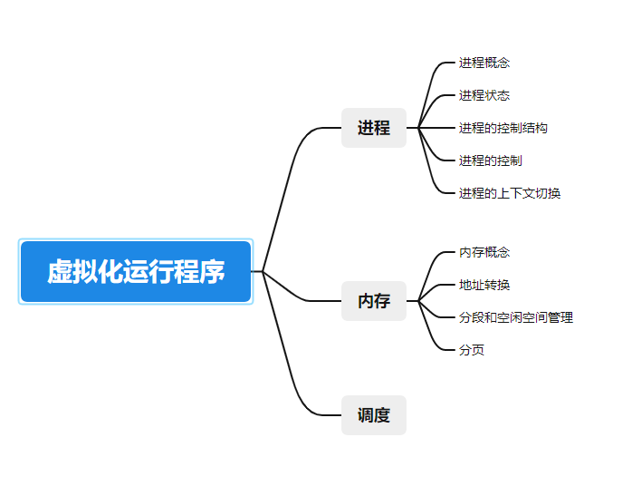

## 进程



进程的非公式定义非常的简单，就是运行中的程序。它是没有生命周期的。我们同工厂希望多个程序能够同时运行，但是cpu是有限的，所以如何抽象出多个cpu成了关键。

这里我们分片的执行各个程序，就完成了多个cpu的抽象。这也就是时分技术，允许多个并发进程，潜在损失就是会失去些许性能。

考虑到近现代储存器的io性能问题，阻塞的执行单个线程的时候，cpu的利用率往往也比较低。这种可以在io时去做别的事情，当io结束之后，cpu又会收到一个中断，之后继续运行。

事实上，大家经常混淆并发和并行的概念，并发时单处理器，虚拟出多个程序执行的假象。并行时多处理器，同时处理多任务。

### 进程的状态

很自然的想到进程的几个状态问题

1. 运行（占用了cpu）
2. 就绪（在队列中就绪，可以运行，但是其他进程处于运行状态而停止运行）
3. 阻塞（等待某一时间发生而被暂停运行）

当然还有结束和创建态

大量的阻塞态是浪费运行空间的，所以，在虚拟内存管理的操作系统中，通常会把阻塞状态的进程的物理内存空间换出到硬盘，等需要再次运⾏的时候，再从硬盘换⼊到物理内存。

描述进程没有占⽤实际的物理内存空间的情况，这个状态就是挂起状态

### 进程的控制结构

在操作系统中，是⽤进程控制块（process control block   PCB）数据结构来描述进程的

PCB 是进程存在的唯⼀标识，这意味着⼀个进程的存在，必然会有⼀个 PCB，如果进程消失 了，那么 PCB 也会随之消失。

看一下数据结构就知道了

```
// the registers xv6 will save and restore // to stop and subsequently restart a process 
struct context {
    int eip;
    int esp;
    int ebx;
    int ecx;
    int edx;
    int esi;
    int edi;
    int ebp; 
};
// the different states a process can be in 
enum proc_state { UNUSED, EMBRYO, SLEEPING,
					RUNNABLE, RUNNING, ZOMBIE };
					
// the information xv6 tracks about each process // including its register context and state 
struct proc {
	char *mem; 					// Start of process memory uint sz; // Size of process memory 
	char *kstack; 				// Bottom of kernel stack
    							// for this process
    enum proc_state state;     	// Process state 
    int pid;                    // Process ID
    struct proc *parent;       	// Parent process
    void *chan; 				// If !zero, sleeping on chan 
    int killed; 				s// If !zero, has been killed
    struct file *ofile[NOFILE]; // Open files
    struct inode *cwd;         	// Current directory
    struct context context;    	// Switch here to run process
    struct trapframe *tf;     	// Trap frame for the
    							// current interrupt
};			
```

看到枚举类型中，还会有一个init状态和已经退出但是没有清理的final状态。

我觉得这两个要着重关注一下，init表示进程创建时的状态。

final，在unix中被成为僵尸状态（僵尸线程），这个状态很有用，因为它允许其他进程检查进程的返回代码，查看刚刚的进程有没有执行成功，完成后，父进程将执行最后一次调用（wait()），等待子进程的返回，并且操作系统随后被告知可以清理这个进程相关的数据结构。

关于程序如何执行成为进程，首先从磁盘加载，之后为运行时的栈分配一些空间，，可能还会有一些初始的参数，就是main函数中的argc和argv，当然还可以用malloc从堆上分出内存去使用，另外还会初始化一些和io相关的任务。

最后进入main函数，cpu的控制权转移到了新创建的进程中。

### 进程api

首先是fork

父进程返回子进程的pid，子进程返回0

```
#include <stdio.h>
#include <stdlib.h>
#include <unistd.h>


int main(){
    printf("now pid:%d\n",(int)getpid());
    int rc = fork();
    if(rc < 0){
        // fail
        fprintf(stderr,"fork failed\n");
        exit(1);
    }
    else if(rc == 0){
        printf("now son pid:%d\n",(int)getpid());
    }else{
        printf("father pid:%d\n",(int)getpid());
    }
    return 0;
}
```

等待子进程执行完毕再执行父进程需要用到wait（）

```
#include <stdio.h>
#include <stdlib.h>
#include <unistd.h>
#include <sys/wait.h>

int main(){
    printf("now pid:%d\n",(int)getpid());
    int rc = fork();
    if(rc < 0){
        // fail
        fprintf(stderr,"fork failed\n");
        exit(1);
    }
    else if(rc == 0){
        printf("now son pid:%d\n",(int)getpid());
    }else{
        int wc = wait(NULL);
        printf("father pid:%d\n",(int)getpid());
        printf("wc:%d\n",wc);
    }
    return 0;
}
```

最后exec（）系统调用,在云盘中，我也用到了相关的函数

```
#include <stdio.h>
#include <stdlib.h>
#include <unistd.h>
#include <sys/wait.h>
#include <string.h>

int main(){
    printf("now pid:%d\n",(int)getpid());
    int rc = fork();
    if(rc < 0){
        // fail
        fprintf(stderr,"fork failed\n");
        exit(1);
    }
    else if(rc == 0){
        printf("child (pid:%d)\n", (int) getpid());
        char *myargs[3];
        myargs[0] = strdup("wc");  
        myargs[1] = strdup("sigio.c"); 
        myargs[2] = NULL;          
        execvp(myargs[0], myargs); 
        printf("this shouldn’t print out");//此处应该不执行
    }else{
        int wc = wait(NULL);
        printf("father pid:%d\n",(int)getpid());
        printf("wc:%d\n",wc);
    }
    return 0;
}
```

