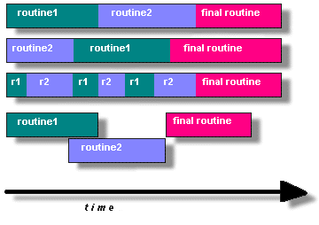

# 设计多线程程序

### 并行编程

在现代计算机上，pthread非常适合并行编程，无论一般适用于并行编程的啥，都使用与并行的pthread程序

设计并行程序有很多的考量因素，例如：

+ 使用什么样的并行编程模型
+ 问题划分
+ 负载均衡
+ 通信
+ 数据依赖
+ 同步和竞态
+ 内存的问题
+ I/O问题
+ 程序的复杂度问题
+ coder的工作量和成本以及事件

涵盖这些主题超出了本教程的范围，但是感兴趣的读者可以在并行计算简介教程中快速了解一下

但总的来说，为了让程序利用pthreads的优势，它必须能够被组织为多个并发执行的离散，独立的任务。例如，如果例程1和例程2可以实时互换，交错或者重叠，则他们是线程化的候选对象。

具有一下特征的程序可能非常适合pthreads:

+ 可以由多个任务同时执行的工作或者数据
+ 阻塞可能很长的I/O
+ 在某些地方使用很多cpu周期，但是在其他地方不使用
+ 必须响应异步事件
+ 有些工作比其他的更重要（优先级）

存在集中常见的线程模型

+ 主从模式：管理器（单个线程）将工作分配给其他的线程，至少两种形式的主从模型比较常见，静态工作池和动态工作池

+ 管道：一个任务被分成一系列的子操作，每个子操作由不同的线程串行处理，但同时进行（生产者，消费者？）
+ 类似于主从，但是主线程创建其他线程之后才参与工作

### 共享内存模型

所有的线程都有权访问相同空间的全局内存

线程也有自己的私有数据

程序员负责同步访问（保护）全局共享数据

### 线程安全

线程安全：简言之，应用程序能够同时执行多个线程而不会`破坏`共享数据或者创建竞态

例如，你的程序创建了多个线程，每个线程调用了一个库：

+ 这个库访问或者修改了内存中的一个全局结构或者位置
+ 每个线程调用这个程序的时候，他们可能会同时尝试修改这个全局内存位置
+ 如果程序不采取一些同步的策略去阻止冲突，那他就不是线程安全的了

如果你不能确定外部库是百分百线程安全的话，你就可能遇到出现线程安全的问题

### 线程限制

尽管pthreadsapi是一个ANSI/IEEE标准，但是实现可以而且通常会以标准中没有指定的方式变化。因此，在一个平台上运行良好的程序可能会在另一个平台上失败或产生错误的结果。例如，允许的最大线程数和默认线程堆栈大小是设计程序时要考虑的两个重要限制。

后续会讨论一些别的线程限制。