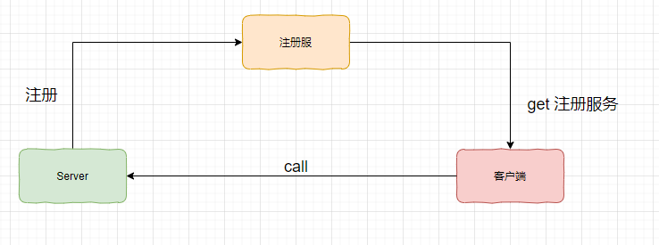
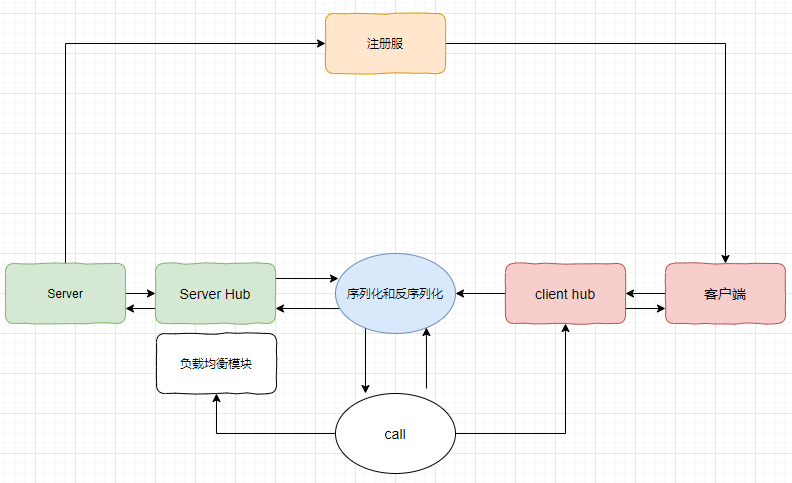

## simleRpc

这里只实现了基本的一下通信和注册的功能，后续可能会继续提升他的完成度

### 我理解中一个合格的Rpc

虽然我的init版本比这个还要钙

正常情况下，RPC框架不仅仅要提供服务发现功能，还要实现负载均衡，容错等能力，这样才有最基本的资格拿到工程中用。

这里叙述一下基本的实现的思路

1. 注册中心是首要，可以考虑使用zk。注册中心放着服务的地址，主要负责注册和查找，可以理解成一个目录，服务端启动的时候会将服务名+ （ip,port）注册到注册服，消费者根据服务名称找到具体的服务地址。然后可以通过网络请求去请求服务端
2. 网络传输
3. 序列化：protobuf？json？
4. 动态代理：
5. 负载均衡：upstream？

### 可以参考的作品

+ [guide-rpc-framework](https://github.com/Snailclimb/guide-rpc-framework)

